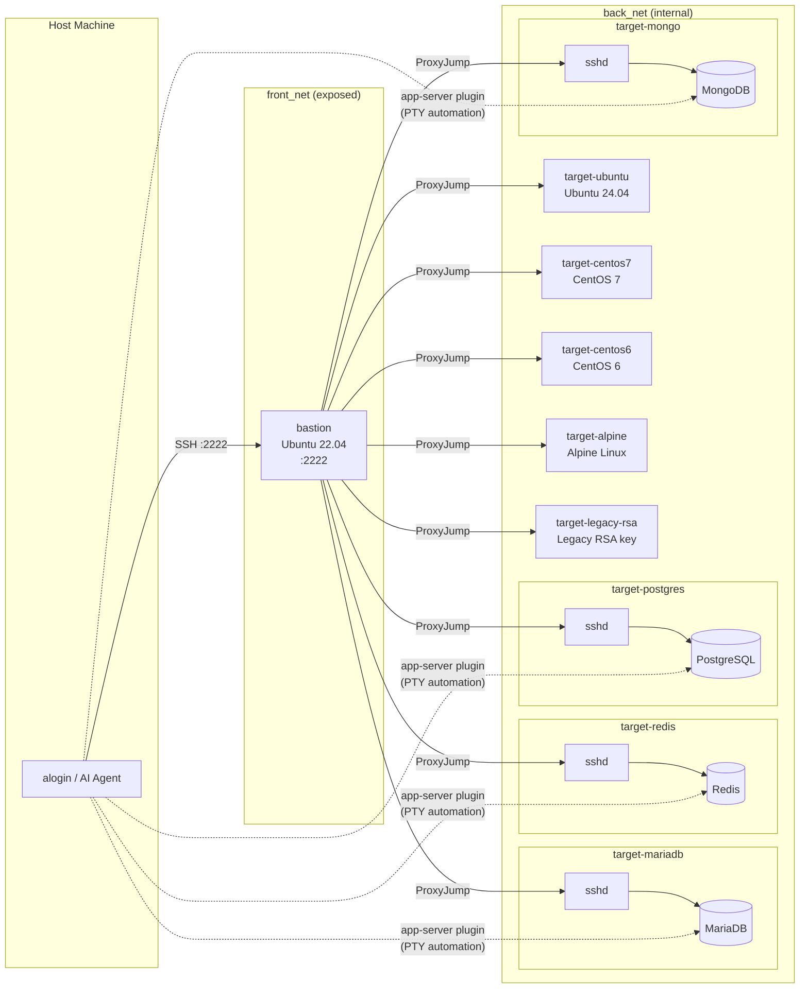

<div align="center">
  
  <a href="https://github.com/emusal/alogin2/releases"></a>
  <a href="https://github.com/emusal/alogin2/blob/main/LICENSE"></a>
</div>

---

**alogin 2**는 Agentic AI, LLM, 시스템 관리자가 인프라에 안전하게 접근할 수 있도록 설계된 보안 게이트웨이입니다.


원본 [alogin v1](https://github.com/emusal/alogin) (~2000년대 Bash + Expect 스크립트)을 Go로 완전히 재작성하였습니다. AI 에이전트가 서버에 안전하게 접근할 수 있는 통로 역할을 하면서, 풍부한 대화형 TUI, 암호화 자격증명 저장소, 멀티 홉 게이트웨이 라우팅, 클러스터 세션 기능을 사람 운영자에게도 제공합니다.

**언어** : 한국어 | [English](README.md)

## 주요 기능

alogin 2는 인간과 AI 에이전트의 역할을 명확히 구분하여 설계되었습니다:

### 🧑‍💻 사람 운영자를 위한 기능
- **대화형 TUI** — 화살표 키 탐색 + 퍼지 검색 호스트 피커 (긴 호스트명을 직접 입력할 필요 없음)
- **클러스터 세션** — tmux(크로스 플랫폼) 또는 iTerm2 / Terminal.app(macOS)을 통해 여러 호스트에 동시 접속
- **쉘 단축키** — `t`, `r`, `s`, `f`, `m`, `ct`, `cr` 약어 명령으로 빠른 접근
- **웹 UI** — 브라우저 기반 SSH 터미널 + 서버 관리 대시보드 (`alogin web`)
- **암호화 자격증명 저장소** — macOS Keychain, Linux Secret Service, 또는 `age` 암호화 파일에 비밀번호를 안전하게 저장

### 🤖 AI 에이전트용 기능 (MCP)
- **Agentic AI 통합** — 내장 [Model Context Protocol (MCP)](https://modelcontextprotocol.io) 서버로 LLM 클라이언트가 원활하게 연결 가능
- **추상화된 연결** — 에이전트는 비밀번호를 복호화하거나 ProxyJump를 이해할 필요 없이, 추상적인 "서버 ID"로 명령 실행을 요청하기만 하면 됨
- **구조화된 출력** — 모든 CLI 명령에서 `--format=json` 지원으로 LLM 파싱 용이
- **완전한 감사 추적** — AI 에이전트가 실행한 모든 명령이 `JSONL` 감사 로그(`audit.jsonl`)에 엄격하게 기록됨

목차
----

<!-- vim-markdown-toc GFM -->
* [설치](#설치)
    * [쉘 통합 설정](#쉘-통합-설정)
* [핵심 개념: 인간과 에이전트 워크플로우](#핵심-개념-인간과-에이전트-워크플로우)
* [사용 시나리오](#사용-시나리오)
    * [시나리오 1: 사람 운영자 (CLI & TUI)](#시나리오-1-사람-운영자-cli--tui)
    * [시나리오 2: AI 인프라 관리 (MCP)](#시나리오-2-ai-인프라-관리-mcp)
* [테스트 환경 (`testenv`)](#테스트-환경-testenv)
* [사용 참조](#사용-참조)
    * [빠른 시작](#빠른-시작)
    * [명령어 개요](#명령어-개요)
    * [연결 및 터널](#연결-및-터널)
* [AI 에이전트 통합 (MCP)](#ai-에이전트-통합-mcp)
    * [MCP 툴 참조](#mcp-툴-참조)
* [고급 주제](#고급-주제)
    * [멀티 홉 게이트웨이 라우팅](#멀티-홉-게이트웨이-라우팅)
    * [클러스터 세션](#클러스터-세션)
    * [보안 및 저장소](#보안-및-저장소)
* [라이선스](#라이선스)
<!-- vim-markdown-toc -->

설치
----

### 스크립트 설치 (Linux / macOS)
`curl`을 사용하여 alogin을 자동으로 다운로드하고 설치할 수 있습니다.

```bash
curl -fsSL https://raw.githubusercontent.com/emusal/alogin2/main/install.sh | sh
```
*팁: `ALOGIN_NO_WEB=1` 환경 변수를 사용하면 웹 인터페이스 없이 더 작은 CLI 전용 바이너리를 설치할 수 있습니다.*

### Homebrew 사용 (macOS)
```bash
brew tap emusal/alogin --custom-remote git@github.com:emusal/alogin2.git
brew install alogin
```

### Windows
네이티브 Windows 바이너리는 지원되지 않습니다. 위의 스크립트를 사용하여 WSL(Windows Subsystem for Linux)을 통해 설치하세요.

### 쉘 통합 설정
단축 별칭 및 탭 자동완성을 활성화하려면 쉘 설정 파일(`~/.zshrc` 또는 `~/.bashrc`)에 다음 줄을 추가하세요.
```bash
source <(alogin shell-init)
```

핵심 개념: 인간과 에이전트 워크플로우
--------------------------------------

alogin 2는 AI 에이전트가 안전하게 동작할 수 있도록 사람 관리자가 초기 "신뢰 레이어"를 구성하는 구조에 의존합니다.

1. **사람 관리자**는 신뢰 프로비저닝을 담당합니다. 서버를 등록하고, 게이트웨이 라우트(점프 호스트)를 정의하며, 비밀번호를 보안 저장소에 저장하고, 매칭 서버를 클러스터로 묶습니다.
2. **AI 에이전트**는 MCP 서버를 통해 연결합니다. 사람이 이미 안전한 경로와 자격증명을 설정했으므로, 에이전트는 단순히 레지스트리를 스캔(`list_servers`)하고, 클러스터를 분석(`get_cluster`)하며, 병렬 SSH 작업을 실행(`exec_on_cluster`)하면 됩니다. *인증 방법을 알 필요가 없습니다.*

사용 시나리오
-------------

### 시나리오 1: 사람 운영자 (CLI & TUI)
일상 운영에서 사람은 빠르고 편리한 접근을 원합니다:

```bash
# 쉘 단축키로 주 데이터베이스에 즉시 접속
t db-primary

# 시각적 퍼지 검색 인터페이스로 오래된 서버 찾기
alogin tui

# SSHFS 단축명령으로 원격 파일 시스템 로컬 마운트
m nas-server /mnt/local_nas

# tmux로 3개의 프로덕션 웹 서버에 동시 접속
ct prod-web-cluster
```

### 시나리오 2: AI 인프라 관리 (MCP)

AI 에이전트가 서버를 관리하도록 하려면 사람이 먼저 레지스트리를 준비해야 합니다.

**1. 사람 준비 단계**
관리자가 AI가 접근 권한을 가질 원격 인프라를 매핑합니다:
```bash
# 1. 서버를 암호화 레지스트리에 추가
alogin compute add --host 10.0.0.10 --user admin  # 저장소 비밀번호 입력 요청
alogin compute add --host 10.0.0.11 --user admin

# 2. AI가 일괄 작업을 쉽게 수행할 수 있도록 그룹화
alogin access cluster add web-cluster 10.0.0.10 10.0.0.11
```

**2. 에이전트 실행 단계**
`alogin agent setup`을 실행하면 복사할 정확한 설정 스니펫과 시스템 프롬프트가 출력됩니다:

```
$ alogin agent setup

alogin — Security Gateway for Agentic AI
========================================

MCP 서버 설정 (Claude Desktop claude_desktop_config.json에 붙여넣기):

  {
    "mcpServers": {
      "alogin": {
        "command": "/usr/local/bin/alogin",
        "args": ["agent", "mcp"]
      }
    }
  }

권장 시스템 프롬프트 스니펫:
  You have access to alogin, a secure SSH gateway for agentic infrastructure access.
  ...

사용 가능한 MCP 툴 (12개): list_servers, get_server, list_tunnels, ...
감사 로그: ~/.config/alogin/audit.jsonl
```

JSON 블록을 `~/Library/Application Support/Claude/claude_desktop_config.json`(macOS)에 붙여넣고 Claude Desktop을 재시작하세요.

이제 사람이 Claude에게 자연어 지시를 입력할 수 있습니다:
> **사람:** *"전체 web-cluster의 디스크 공간을 확인해줘."*
> **Claude:** `get_cluster_info`로 노드를 찾고, `exec_on_cluster`로 두 노드에서 병렬로 `df -h`를 실행합니다. stdout을 직접 읽고 위험도를 요약하여 사람에게 보고합니다.

테스트 환경 (`testenv`)
-----------------------

alogin 2는 `testenv/` 디렉토리 안에 완전한 가상화 **Docker Compose** 샌드박스를 포함합니다. 에이전트 동작 테스트, 멀티 홉 SSH 라우팅 스크립팅, 크로스 OS 호환성 검증, 앱 서버 플러그인 시스템 테스트에 활용할 수 있습니다.

**네트워크 토폴로지:**



**SSH 대상:**
* `bastion` (Ubuntu 22.04) — 포트 `2222`로 호스트에 노출된 유일한 노드. 모든 back-net 대상의 점프 호스트 역할.
* `target-ubuntu` (Ubuntu 24.04) — 표준 최신 테스트 노드.
* `target-centos7` (CentOS 7) — 레거시 EOL OS 호환성 (sysvinit, 구형 패키지 매니저).
* `target-centos6` (CentOS 6) — 극단적인 레거시 테스트용 매우 오래된 EOL OS.
* `target-alpine` (Alpine) — 경량 컨테이너 OS.
* `target-legacy-rsa` (Legacy RSA key) — 구형 RSA 호스트 키가 필요한 SSH 연결 테스트.

**앱 서버 플러그인 대상** (모든 자격증명: `testuser` / `testuser`):
* `target-mariadb` — MariaDB 실행. 플러그인: `testenv/plugins/mariadb.yaml`
* `target-redis` — 비밀번호 인증이 있는 Redis 실행. 플러그인: `testenv/plugins/redis.yaml`
* `target-postgres` — PostgreSQL 실행. 플러그인: `testenv/plugins/postgres.yaml`
* `target-mongo` — MongoDB 실행. 플러그인: `testenv/plugins/mongo.yaml`

**실행 방법:**
```bash
cd testenv/
docker-compose up -d --build

# 컨테이너 기동 후 alogin 레지스트리 일괄 등록
bash testenv/setup_alogin_cluster.sh
```

setup 스크립트가 수행하는 작업:
1. `bastion_host` (localhost:2222) 호스트 및 서버 등록
2. `bastion_gw` 게이트웨이 경로 등록
3. SSH 타겟 서버 5개 등록 (gateway: bastion_gw)
4. DB/Cache 플러그인 테스트 서버 4개 등록 (gateway: bastion_gw)
5. `test-cluster` (SSH 5개), `db-cluster` (DB 4개) 클러스터 생성
6. `testenv/plugins/*.yaml` → `~/.config/alogin/plugins/` 설치
7. `app-server` 바인딩 4개 등록 (mariadb-test, redis-test, postgres-test, mongo-test)

**앱 서버 플러그인 테스트:**
```bash
# 1. 테스트 플러그인을 alogin 플러그인 디렉토리에 복사
cp testenv/plugins/*.yaml ~/.config/alogin/plugins/

# 2. 저장소 자격증명 등록 (비밀번호: testuser)
alogin compute add --host target-mariadb --user testuser --gateway bastion
alogin auth vault set testuser@target-mariadb   # 입력: testuser

# 3. 앱 서버 바인딩 추가
alogin app-server add --name test-mysql --server target-mariadb --app mariadb --auto-gw

# 4. 연결 — SSH 접속 후 mysql 실행, 자동 비밀번호 입력
alogin app-server connect test-mysql

# 5. 비대화형 쿼리
alogin app-server connect test-mysql --cmd "SHOW DATABASES;"
```

사용 참조
---------

### 빠른 시작
**1. 설치 확인**
```bash
alogin version
```
**2. 서버 추가 및 연결**
```bash
alogin compute add
alogin access ssh web-01       # 또는 't web-01' 사용
```

### 명령어 개요
모든 레거시 v1 명령어는 하위 호환 별칭으로 유지됩니다.

```
alogin compute          서버 레지스트리 관리 (별칭: server)
alogin access           원격 연결 (별칭: connect, t, r)
alogin auth             자격증명, 게이트웨이 라우트, 호스트 별칭
alogin agent            AI MCP 서버, 클라이언트 설정 툴
alogin net              호스트 정의, 백그라운드 SSH 터널
alogin app-server       이름 지정 서버+플러그인 바인딩 (한 번에 실행)
```

**스크립트용 JSON 출력:** 모든 목록 명령에서 `--format=json` 지원.

### 연결 및 터널
```bash
alogin access ssh gw-01 web-01                 # 명시적 2홉 라우트
alogin access ssh web-01 --auto-gw             # 등록된 게이트웨이로 자동 라우팅
alogin access ssh web-01 --cmd "uptime"        # 단독 명령 실행 후 종료
alogin access ssh web-01 --app mariadb         # 연결 후 앱 플러그인 실행 (예: MariaDB 클라이언트)
```

**터널:** 터미널 연결이 끊겨도 유지되도록 분리된 `tmux` 백그라운드 세션 안에서 SSH 포트 포워드를 쉽게 유지합니다.
```bash
alogin net tunnel add web-local --server web-01 --local-port 8080 --remote-port 80
alogin net tunnel start web-local
```

### 앱 서버 (이름 지정 애플리케이션 바인딩)
서버를 애플리케이션 플러그인에 바인딩하면 하나의 이름으로 자격증명 자동 주입과 함께 올바른 앱을 실행합니다:
```bash
alogin app-server add --name prod-mysql --server prod-db --app mariadb --auto-gw
alogin app-server connect prod-mysql          # SSH → MariaDB 클라이언트 실행 → 자동 비밀번호 입력
alogin app-server connect prod-mysql --cmd "SHOW DATABASES"  # 비대화형
alogin app-server list --format json
```
플러그인 YAML 파일(`~/.config/alogin/plugins/<name>.yaml`)은 자격증명 주입을 위한 명령, 인수, PTY 자동화(expect/send)를 정의합니다.

AI 에이전트 통합 (MCP)
----------------------

alogin은 내장 [Model Context Protocol (MCP)](https://modelcontextprotocol.io) 서버를 제공하므로, LLM 클라이언트가 자격증명이나 SSH 라우팅을 직접 처리하지 않고도 인프라를 안전하게 관리할 수 있습니다.

> [SKILL.md](SKILL.md)에서 빠른 시작 가이드를, [docs/SYSTEM_PROMPT.md](docs/SYSTEM_PROMPT.md)에서 전체 시스템 프롬프트 참조를 확인하세요.

### MCP 툴 참조

#### 쿼리 툴 (읽기 전용)

| 툴 | 설명 |
|------|------|
| `list_servers` | 레지스트리의 모든 서버 목록/검색 |
| `get_server` | 단일 서버의 전체 상세 정보 조회 |
| `list_clusters` | 멤버 수와 함께 모든 클러스터 그룹 목록 |
| `get_cluster` | 전체 멤버 서버 상세 정보와 함께 클러스터 조회 |
| `list_tunnels` | 실시간 실행 상태와 함께 터널 설정 목록 |
| `get_tunnel` | 단일 터널의 상세 정보 및 상태 조회 |
| `inspect_node` | 구조화된 상태 스냅샷 — CPU, 메모리, 디스크, 상위 프로세스 |

#### 실행 툴 (쓰기)

| 툴 | 설명 |
|------|------|
| `exec_command` | 단일 서버에서 SSH 명령 실행 (비대화형 또는 PTY 모드) |
| `exec_on_cluster` | 모든 클러스터 서버에서 병렬로 SSH 명령 실행 |

#### 터널 생명주기 툴

| 툴 | 설명 |
|------|------|
| `start_tunnel` | 분리된 tmux 세션에서 저장된 터널 시작 |
| `stop_tunnel` | 실행 중인 터널 중지 |

모든 `exec_command`, `exec_on_cluster`, `inspect_node` 호출은 `~/.config/alogin/audit.jsonl`과 `audit_log` SQLite 테이블에 기록됩니다.

### 에이전트 안전 가드레일

#### 전역 정책 (`~/.config/alogin/agent-policy.yaml`)
```bash
alogin agent policy show       # 활성 전역 정책 파일 출력
alogin agent policy validate   # 구문/패턴 오류 검증
```

#### 서버별 정책 및 시스템 프롬프트
각 서버는 전역 정책을 재정의하고 데이터베이스에 저장된 커스텀 LLM 시스템 프롬프트를 가질 수 있습니다:
```bash
alogin agent server-policy set   <id> --file policy.yaml   # 서버별 정책 설정
alogin agent server-policy show  <id>                       # 서버별 정책 표시
alogin agent server-policy clear <id>                       # 전역 정책으로 되돌리기

alogin agent server-prompt set   <id> --text "..."          # 서버별 시스템 프롬프트 설정
alogin agent server-prompt show  <id>                       # 서버별 시스템 프롬프트 표시
alogin agent server-prompt clear <id>                       # 서버별 프롬프트 제거
```

#### HITL (Human-in-the-Loop) 승인
파괴적인 명령(또는 `require_approval` 정책 규칙에 매칭되는 명령)은 사람의 승인을 위해 일시 중지됩니다:
```bash
alogin agent pending              # 승인 대기 중인 요청 목록
alogin agent approve <token>      # 대기 중인 요청 승인
alogin agent deny    <token>      # 대기 중인 요청 거부
```

#### 감사 로그
```bash
alogin agent audit list           # 최근 MCP 실행 이벤트 목록
alogin agent audit list --since 1h --json
alogin agent audit tail           # 새 이벤트 스트리밍 (Ctrl+C로 중지)
```

고급 주제
---------

### 멀티 홉 게이트웨이 라우팅
Go의 네이티브 SSH 라이브러리가 ProxyJump를 기본적으로 처리합니다. 라우트(`alogin auth gateway add`)를 정의하고 할당하기만 하면 됩니다. alogin은 TCP 스트림에서 `ProxyCommand` 쉘을 완전히 우회합니다. 중간 홉이 `AllowTcpForwarding=no`를 금지하는 경우, alogin은 이를 스마트하게 감지하여 중첩된 `ssh -tt` 의사 터미널 체이닝으로 우아하게 폴백합니다.

### 클러스터 세션
`ct <cluster>`를 실행하면 alogin이 그룹화된 모든 멤버에 동시에 연결하고 팬 간에 입력을 동기화합니다.
```bash
alogin access cluster prod-web --mode tmux      # tmux 팬 (macOS + Linux)
alogin access cluster prod-web --mode iterm     # iTerm2 분할 팬 (macOS)
```

### 보안 및 저장소
비밀번호는 명시적으로 강제하지 않는 한 로컬 SQLite DB에 저장되지 않습니다. 비밀값 우선순위:
1. `macOS Keychain` / `Linux Secret Service`
2. `age` 암호화 파일 (폴백)
3. 직접 `~/.ssh/config` 에이전트 처리 (권장! 먼저 서버에 키를 등록하세요!)

라이선스
--------
Apache 2.0
