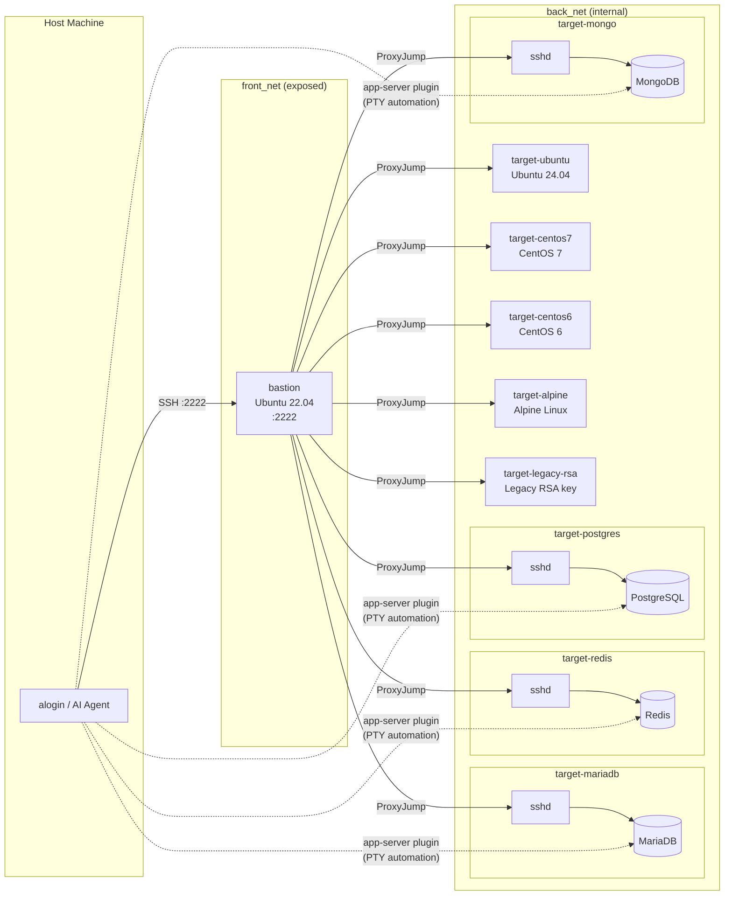

<div align="center">
  
  <a href="https://github.com/emusal/alogin2/releases"></a>
  <a href="https://github.com/emusal/alogin2/blob/main/LICENSE"></a>
</div>

---

**alogin 2**는 수백 대 서버를 관리하는 시스템/네트워크 엔지니어를 위한 SSH 게이트웨이입니다. AI 에이전트가 비밀번호나 인증 정보를 전혀 모르는 상태에서도 인프라를 안전하게 다룰 수 있는 MCP 브리지 역할도 겸합니다.


원본 [alogin v1](https://github.com/emusal/alogin)(2000년대 초 Bash + Expect 스크립트)을 Go로 처음부터 다시 만들었습니다. 같은 암호화 레지스트리 위에서 사람의 일상 업무와 AI 자동화를 함께 처리합니다.

**Language**: 한국어 | [English](README.md)

---

## alogin2를 쓰는 이유

서버가 수백 대를 넘어가면 두 가지 문제가 생깁니다. 운영자는 반복적인 SSH 접속에 시간을 낭비하고, AI 에이전트에게는 실제 비밀번호나 내부 IP를 보여줘선 안 됩니다.

alogin2는 그 두 가지를 한 번에 해결합니다.

| 불편한 점 | alogin2의 해결 방식 |
|-----------|---------------------|
| 수백 개 서버 중 원하는 곳에 접속하려면 호스트명을 다 기억해야 한다 | [퍼지 검색 TUI](#퍼지-tui-검색) — 몇 글자만 입력해도 바로 찾아줌 |
| Bastion 서버를 거칠 때마다 ProxyJump 설정을 매번 손으로 해야 한다 | [게이트웨이 라우트 등록 한 번](#멀티-홉-게이트웨이-라우팅) — 이후엔 자동으로 경로를 찾아줌 |
| 20개 서버에 같은 명령을 하나씩 실행해야 한다 | [클러스터 세션 + 동시 입력 전송](#동기화-브로드캐스트-타이핑) — 한 번 치면 전체에 실행됨 |
| 여러 서버의 출력을 모아서 확인하기가 번거롭다 | [클러스터 병렬 실행](#병렬-명령-실행) — 결과를 노드별로 정리해서 돌려줌 |
| AI가 서버에 접근하려면 비밀번호나 IP를 알아야 한다 | [MCP 추상화 레이어](#제로-지식-보안-모델) — AI는 서버 이름만 알고, 인증은 alogin2가 처리 |
| AI가 어떤 명령을 실행했는지 추적하기 어렵다 | [실행 이력 자동 기록](#감사-추적) — JSONL 파일 + SQLite에 남김 |
| AI가 위험한 명령을 실행할까 봐 걱정된다 | [정책 설정 + 사람 승인 단계](#정책-엔진--hitl-승인) — 위험 명령은 막거나 승인 후에만 실행 |

---

## 목차

- [설치](#설치)
- [개인 효율: 접속 속도 높이기](#개인-효율-접속-속도-높이기)
  - [퍼지 TUI 검색](#퍼지-tui-검색)
  - [멀티 홉 게이트웨이 라우팅](#멀티-홉-게이트웨이-라우팅)
  - [앱 서버 플러그인 바인딩](#앱-서버-플러그인-바인딩)
- [플릿 관리: 여러 서버를 한 번에](#플릿-관리-여러-서버를-한-번에)
  - [클러스터 세션 (타일 UI)](#클러스터-세션-타일-ui)
  - [동기화 브로드캐스트 타이핑](#동기화-브로드캐스트-타이핑)
  - [병렬 명령 실행](#병렬-명령-실행)
  - [백그라운드 터널 유지](#백그라운드-터널-유지)
- [AI와 안전하게 연동하기](#ai와-안전하게-연동하기)
  - [MCP 서버 설정](#mcp-서버-설정)
  - [제로 지식 보안 모델](#제로-지식-보안-모델)
  - [MCP 툴 목록](#mcp-툴-목록)
  - [정책 엔진 & HITL 승인](#정책-엔진--hitl-승인)
  - [감사 추적](#감사-추적)
- [비밀번호 저장 방식](#비밀번호-저장-방식)
- [명령어 한눈에 보기](#명령어-한눈에-보기)
- [테스트 환경](#테스트-환경)
- [라이선스](#라이선스)

---

## 설치

### 스크립트 설치 (Linux / macOS)

```bash
curl -fsSL https://raw.githubusercontent.com/emusal/alogin2/main/install.sh | sh
```

> `ALOGIN_NO_WEB=1` 환경변수를 설정하면 웹 UI 없이 더 가벼운 CLI 전용 바이너리를 설치합니다.

### Homebrew (macOS)

```bash
brew tap emusal/alogin --custom-remote git@github.com:emusal/alogin2.git
brew install alogin
```

### Windows

네이티브 바이너리는 지원하지 않습니다. WSL(Windows Subsystem for Linux)에서 위의 스크립트로 설치하세요.

### 쉘 통합

`t`, `r`, `ct`, `cr` 같은 단축 명령과 탭 자동완성을 쓰려면 `~/.zshrc` 또는 `~/.bashrc`에 한 줄 추가하세요:

```bash
source <(alogin shell-init)
```

---

## 개인 효율: 접속 속도 높이기

### 퍼지 TUI 검색

`alogin tui`를 실행하면 서버 목록이 뜹니다. 호스트명 일부, IP, 태그 어느 것이든 몇 글자만 입력하면 해당 서버로 좁혀집니다. 방향키로 고르고 Enter를 누르면 바로 접속됩니다.

```bash
alogin tui
# 또는 쉘 단축 명령:
t <검색어>
```

수백 개 서버의 이름을 외울 필요가 없습니다.

### 멀티 홉 게이트웨이 라우팅

Bastion을 거쳐야 하는 서버라면, 게이트웨이 라우트를 한 번만 등록해두면 그 다음부터는 alogin2가 알아서 경로를 찾아 접속합니다. `~/.ssh/config`를 고칠 필요가 없습니다.

```bash
# Bastion 서버를 게이트웨이로 등록 (최대 3홉까지 지원)
alogin auth gateway add prod-bastion bastion-01
alogin auth gateway add dmz-chain bastion-01 dmz-relay

# 서버를 추가할 때 게이트웨이를 함께 지정
alogin compute add --host 10.0.1.50 --user admin --gateway prod-bastion

# 이후엔 그냥 접속하면 됨
t web-01
# 또는:
alogin access ssh web-01 --auto-gw
```

중간 서버에서 TCP 포워딩을 막아놨어도(`AllowTcpForwarding no`) 괜찮습니다. alogin2가 자동으로 감지하고 `ssh -tt` 체인 방식으로 전환합니다.

### 앱 서버 플러그인 바인딩

서버와 DB 클라이언트(MariaDB, Redis, PostgreSQL, MongoDB 등)를 이름 하나로 묶어두면, 명령 한 번에 SSH 접속 → 클라이언트 실행 → 비밀번호 자동 입력까지 이어집니다.

```bash
alogin app-server add --name prod-mysql --server prod-db --app mariadb --auto-gw
alogin app-server connect prod-mysql                          # 대화형 세션
alogin app-server connect prod-mysql --cmd "SHOW DATABASES;"  # 비대화형 쿼리
alogin app-server list --format json
```

플러그인은 `~/.config/alogin/plugins/<name>.yaml` 파일로 정의하며, 실행 명령과 PTY 자동화(expect/send) 시퀀스를 담습니다.

---

## 플릿 관리: 여러 서버를 한 번에

### 클러스터 세션 (타일 UI)

서버들을 클러스터로 묶어두면, 명령 한 번에 전체를 tmux 분할 화면으로 열 수 있습니다.

```bash
# 클러스터 정의
alogin access cluster add web-cluster web-01 web-02 web-03
alogin access cluster add db-shard db-primary db-replica1 db-replica2

# 전체를 한 번에 열기
ct web-cluster                                               # 쉘 단축 명령
alogin access cluster web-cluster --mode tmux                # tmux (Linux + macOS)
alogin access cluster web-cluster --mode iterm               # iTerm2 (macOS)
```

### 동기화 브로드캐스트 타이핑

클러스터 세션이 열리면 alogin2는 각 서버의 로그인이 모두 완료될 때까지 기다립니다. 비밀번호 자동 입력이 끝난 뒤에 tmux의 `synchronize-panes`를 켜기 때문에, 그 시점부터는 한 번의 입력이 전체 서버에 동시에 전달됩니다.

```
# sync-panes가 켜진 후, 한 번 입력하면 전체 서버에서 실행됩니다:
df -h
systemctl status nginx
tail -f /var/log/app/error.log
```

서버 수에 따라 대기 시간이 자동으로 조정됩니다. 4대 이하는 5초, 10대 이하는 8초, 그 이상은 12초입니다.

### 병렬 명령 실행

터미널 세션 없이 클러스터 전체에 명령을 던지고 서버별 결과를 한꺼번에 받을 수 있습니다.

```bash
alogin access ssh web-cluster --cmd "uptime"
alogin access ssh db-shard    --cmd "df -h /data"
```

AI 에이전트에서는 `exec_on_cluster`를 쓰면 병렬 실행 결과가 서버별 JSON으로 돌아옵니다.

### 백그라운드 터널 유지

포트 포워딩 터널을 tmux 백그라운드 세션으로 띄워두면, 터미널을 닫거나 노트북이 슬립에 들어가도 터널이 끊기지 않습니다.

```bash
alogin net tunnel add grafana-fwd --server monitoring-01 --local-port 3000 --remote-port 3000
alogin net tunnel start grafana-fwd
alogin net tunnel list
alogin net tunnel stop  grafana-fwd
```

---

## AI와 안전하게 연동하기

### MCP 서버 설정

alogin2는 [Model Context Protocol (MCP)](https://modelcontextprotocol.io) 서버를 내장하고 있습니다. `alogin agent setup`을 실행하면 AI 클라이언트에 붙여넣을 설정이 바로 출력됩니다.

```
$ alogin agent setup

alogin — Security Gateway for Agentic AI
========================================

MCP 서버 설정 (Claude Desktop claude_desktop_config.json에 붙여넣기):

  {
    "mcpServers": {
      "alogin": {
        "command": "/usr/local/bin/alogin",
        "args": ["agent", "mcp"]
      }
    }
  }

사용 가능한 MCP 툴 (12개): list_servers, get_server, list_clusters, get_cluster,
  exec_command, exec_on_cluster, inspect_node, list_tunnels, get_tunnel,
  start_tunnel, stop_tunnel, ...
감사 로그: ~/.config/alogin/audit.jsonl
```

JSON 블록을 `~/Library/Application Support/Claude/claude_desktop_config.json`(macOS)에 붙여넣고 Claude Desktop을 재시작하면 됩니다.

### 제로 지식 보안 모델

AI는 서버 이름(ID)만 알고, 실제 비밀번호나 IP는 절대 볼 수 없습니다. 인증은 전부 alogin2가 로컬에서 처리합니다.

```
AI 에이전트  ──→  alogin2 MCP  ──→  Vault(저장소)  ──→  SSH 대상
              (서버 이름만 사용)    (비밀번호 복호화)    (인증 완료)
                    ↑
         AI가 절대 알 수 없는 정보:
         - 비밀번호 / SSH 개인 키
         - 실제 IP 주소
         - Bastion 경로 구조
         - Vault 내용
```

운영자가 먼저 서버와 자격증명을 등록해두면, AI는 그 위에서 안전하게 작업합니다.

```bash
# 운영자가 미리 준비:
alogin compute add --host 10.0.0.10 --user admin   # 비밀번호는 Vault에 저장
alogin compute add --host 10.0.0.11 --user admin
alogin access cluster add web-cluster 10.0.0.10 10.0.0.11

# AI는 이름만 가지고 동작:
# list_servers → [ {id: 1, name: "web-01"}, {id: 2, name: "web-02"} ]
# exec_on_cluster(cluster_id=1, commands=["df -h"])
# → 서버별 실행 결과 반환 (AI에게 비밀번호 전달 없음)
```

### MCP 툴 목록

#### 조회 (읽기 전용)

| 툴 | 설명 |
|----|------|
| `list_servers` | 등록된 서버 전체 검색 |
| `get_server` | 특정 서버의 상세 정보 조회 |
| `list_clusters` | 클러스터 목록과 멤버 수 |
| `get_cluster` | 클러스터와 소속 서버 전체 정보 |
| `list_tunnels` | 터널 설정 목록 및 실행 상태 |
| `get_tunnel` | 특정 터널의 상태 조회 |
| `inspect_node` | 서버 상태 스냅샷 (CPU, 메모리, 디스크, 프로세스) |

#### 실행 (쓰기)

| 툴 | 설명 |
|----|------|
| `exec_command` | 단일 서버에 SSH 명령 실행 |
| `exec_on_cluster` | 클러스터 전체에 병렬 실행 |

#### 터널 제어

| 툴 | 설명 |
|----|------|
| `start_tunnel` | 저장된 터널을 백그라운드로 시작 |
| `stop_tunnel` | 실행 중인 터널 중지 |

모든 실행 호출은 `~/.config/alogin/audit.jsonl`과 SQLite `audit_log` 테이블에 기록됩니다.

### 정책 엔진 & HITL 승인

AI가 어떤 명령을 실행할 수 있는지 YAML 파일로 제어합니다. 위에서부터 첫 번째로 조건이 맞는 규칙이 적용됩니다.

**전역 정책** (`~/.config/alogin/agent-policy.yaml`):

```yaml
rules:
  - match:
      commands: ["^(shutdown|reboot|halt|poweroff)", "^rm\\s", "^dd\\s", "^mkfs"]
    action: deny

  - match:
      commands: ["^systemctl\\s+(stop|disable|mask)"]
      server_ids: [1, 2, 3]
    action: require_approval

  - match:
      time_window: { start: "18:00", end: "08:00" }   # UTC
    action: deny

  - match: {}
    action: allow
```

**서버별 정책 덮어쓰기:**

```bash
alogin agent server-policy set  <서버-id> --file policy.yaml
alogin agent server-policy show <서버-id>
alogin agent server-policy clear <서버-id>   # 전역 정책으로 되돌리기
```

**정책 관리:**

```bash
alogin agent policy show      # 현재 적용 중인 정책 확인
alogin agent policy validate  # 문법 오류 검사
```

**HITL (사람 승인 단계):**

`require_approval`로 설정된 명령이 들어오면 실행이 멈추고, 운영자 확인을 기다립니다. 승인 대기 중인 요청은 파일로 남고, 아래 명령으로 처리합니다.

```bash
alogin agent pending              # 대기 중인 요청 확인
alogin agent approve <token>      # 승인
alogin agent deny    <token>      # 거부
```

`rm`, `dd`, `mkfs`, `shutdown`, `reboot`, `systemctl stop/disable/mask`, `DROP TABLE`, `TRUNCATE`, 파일 덮어쓰기(`>`) 등의 명령은 기본적으로 위험 패턴으로 분류됩니다.

### 감사 추적

```bash
alogin agent audit list                    # 최근 실행 이력
alogin agent audit list --since 1h --json  # 최근 1시간, JSON 형식
alogin agent audit tail                    # 실시간 스트리밍 (Ctrl+C로 종료)
```

각 이벤트에는 실행 시각, 에이전트 ID, 대상 서버/클러스터, 실행 명령, 정책 결과, 승인 토큰이 함께 기록됩니다.

---

## 비밀번호 저장 방식

비밀번호는 SQLite에 평문으로 저장하지 않습니다. 아래 순서로 저장 위치를 선택합니다.

1. **macOS Keychain** / **Linux Secret Service** (systemd/GNOME)
2. **age 암호화 파일** (`~/.local/share/alogin/vault.age`)
3. 평문 저장 (명시적으로 선택할 때만)

가능하면 SSH 키 인증을 쓰는 것을 권장합니다. 키 배포가 어려운 환경에서만 비밀번호 저장을 사용하세요.

---

## 명령어 한눈에 보기

```
alogin compute          서버 등록 및 관리 (add, list, show, edit, remove)
alogin access           SSH 접속, 클러스터 세션, SCP, SSHFS
alogin auth             비밀번호 저장, 게이트웨이 라우트, 별칭 관리
alogin agent            MCP 서버, 정책, 사람 승인, 실행 이력
alogin net              hosts 항목 관리, 백그라운드 SSH 터널
alogin app-server       서버 + 앱 플러그인 묶음 관리
alogin tui              TUI 서버 검색 화면
alogin web              웹 브라우저 SSH 터미널 + 관리 대시보드
```

목록 조회 명령에는 모두 `--format=json`을 쓸 수 있습니다.
전체 명령어 목록: [docs/cli-command-map.md](docs/cli-command-map.md)

---

## 테스트 환경

`testenv/` 디렉토리에 Docker Compose 기반 샌드박스가 포함되어 있습니다. 멀티 홉 라우팅, 다양한 OS 호환성, MCP 동작, 앱 서버 플러그인을 실제로 테스트해볼 수 있습니다.

```bash
cd testenv/
docker-compose up -d --build
bash testenv/setup_alogin_cluster.sh  # 테스트 서버 일괄 등록
```

setup 스크립트가 자동으로 처리하는 항목:
1. `bastion_host` (localhost:2222) 및 `bastion_gw` 게이트웨이 등록
2. SSH 테스트 서버 5개 등록 (gateway: bastion_gw)
3. DB/Cache 테스트 서버 4개 등록 (gateway: bastion_gw)
4. `test-cluster` (SSH 5개), `db-cluster` (DB 4개) 클러스터 생성
5. `testenv/plugins/*.yaml` → `~/.config/alogin/plugins/` 설치
6. `app-server` 바인딩 4개 등록 (mariadb-test, redis-test, postgres-test, mongo-test)

**네트워크 구성:**



**SSH 대상:** bastion (점프 호스트, `:2222`), Ubuntu 24.04, CentOS 7, CentOS 6, Alpine, 레거시 RSA 키 서버

**앱 서버 대상** (계정: `testuser` / `testuser`): MariaDB, Redis, PostgreSQL, MongoDB

MCP 툴 전체 목록 및 권장 시스템 프롬프트: [docs/SYSTEM_PROMPT.md](docs/SYSTEM_PROMPT.md)
에이전트 정책 작성 방법 및 승인 플로우 예시: [docs/agent-policy.md](docs/agent-policy.md)

---

## 라이선스

Apache 2.0
