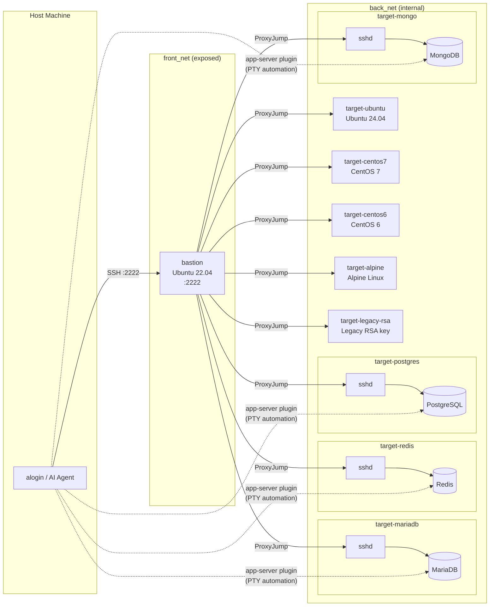

<div align="center">
  
  <a href="https://github.com/emusal/alogin2/releases"></a>
  <a href="https://github.com/emusal/alogin2/blob/main/LICENSE"></a>
</div>

---

**alogin 2** is a secure SSH gateway for system and network engineers managing large server fleets — and a zero-knowledge MCP bridge for AI agents that need infrastructure access without ever touching your credentials.


Full Go rewrite of the original [alogin v1](https://github.com/emusal/alogin) (~2000s Bash + Expect). Designed for daily operator workflow and AI-driven automation on the same encrypted registry.

**Language**: [한국어](README.ko.md) | English

---

## Why alogin2?

Managing hundreds of servers creates two friction points: **human operators** waste keystrokes on repeated SSH commands, and **AI agents** shouldn't see raw credentials or private IP topology.

alogin2 resolves both:

| Problem | Solution |
|---------|----------|
| Typing full hostnames for hundreds of nodes | [Fuzzy TUI search](#fuzzy-tui-search) → connect in 3 keystrokes |
| Manual ProxyJump setup for bastion chains | [Named gateway routes with automatic multi-hop](#multi-hop-gateway-routing) |
| Running the same command across 20 nodes | [Cluster session with synchronized broadcast typing](#synchronized-broadcast-typing) |
| Aggregating command output from a fleet | [Parallel `exec_on_cluster` via MCP](#parallel-command-execution), results returned as structured data |
| AI agents needing SSH credentials / IPs | [MCP abstraction layer: agents use server IDs, alogin2 handles auth](#zero-knowledge-security-model) |
| Audit trail for AI-initiated commands | [Every exec logged to JSONL + SQLite `audit_log`](#audit-trail) |
| Runaway AI executing destructive commands | [Policy engine + HITL approval flow](#policy-engine--hitl-approval) |

---

## Table of Contents

- [Installation](#installation)
- [Individual Efficiency: Eliminating Friction](#individual-efficiency-eliminating-friction)
  - [Fuzzy TUI Search](#fuzzy-tui-search)
  - [Multi-hop Gateway Routing](#multi-hop-gateway-routing)
  - [App-Server Plugin Bindings](#app-server-plugin-bindings)
- [Fleet Management: Control at Scale](#fleet-management-control-at-scale)
  - [Cluster Sessions (Tiled UI)](#cluster-sessions-tiled-ui)
  - [Synchronized Broadcast Typing](#synchronized-broadcast-typing)
  - [Parallel Command Execution](#parallel-command-execution)
  - [Persistent Background Tunnels](#persistent-background-tunnels)
- [Secure AI Integration](#secure-ai-integration)
  - [MCP Server Setup](#mcp-server-setup)
  - [Zero-Knowledge Security Model](#zero-knowledge-security-model)
  - [MCP Tools Reference](#mcp-tools-reference)
  - [Policy Engine & HITL Approval](#policy-engine--hitl-approval)
  - [Audit Trail](#audit-trail)
- [Security & Vault](#security--vault)
- [Commands Overview](#commands-overview)
- [Test Environment](#test-environment)
- [License](#license)

---

## Installation

### Script install (Linux / macOS)

```bash
curl -fsSL https://raw.githubusercontent.com/emusal/alogin2/main/install.sh | sh
```

> `ALOGIN_NO_WEB=1` installs a smaller CLI-only binary without the embedded web interface.

### Homebrew (macOS)

```bash
brew tap emusal/alogin --custom-remote git@github.com:emusal/alogin2.git
brew install alogin
```

### Windows

Use WSL (Windows Subsystem for Linux) with the script above.

### Shell integration

Add to `~/.zshrc` or `~/.bashrc` to enable shorthand aliases (`t`, `r`, `ct`, `cr`, ...) and tab completion:

```bash
source <(alogin shell-init)
```

---

## Individual Efficiency: Eliminating Friction

### Fuzzy TUI Search

Launch the interactive host picker. Type a partial hostname, tag, or IP. Arrow-navigate and press Enter to connect:

```bash
alogin tui
# or use shell alias:
t <partial-name>
```

No need to remember full hostnames across hundreds of nodes. Fuzzy match on any field.

### Multi-hop Gateway Routing

Define a named gateway route once, assign it to servers. alogin2 handles the full hop chain natively in Go — no `ProxyCommand` shell spawning, no `~/.ssh/config` edits:

```bash
# Register jump hosts as a named route (up to 3 hops)
alogin auth gateway add prod-bastion bastion-01
alogin auth gateway add dmz-chain bastion-01 dmz-relay

# Assign a gateway to a server
alogin compute add --host 10.0.1.50 --user admin --gateway prod-bastion

# Connect — alogin resolves the full chain automatically
t web-01
# or explicitly:
alogin access ssh web-01 --auto-gw
```

**ShellChain fallback:** If an intermediate hop has `AllowTcpForwarding no`, alogin2 automatically detects the failure and retries using nested `ssh -tt` pseudo-terminal chaining — no manual intervention required.

### App-Server Plugin Bindings

Bind a server to an application plugin (MariaDB, Redis, PostgreSQL, MongoDB, ...) so one command SSHes in, launches the client, and auto-injects credentials from the vault:

```bash
alogin app-server add --name prod-mysql --server prod-db --app mariadb --auto-gw
alogin app-server connect prod-mysql               # interactive session
alogin app-server connect prod-mysql --cmd "SHOW DATABASES;"  # non-interactive
alogin app-server list --format json
```

Plugin definitions live in `~/.config/alogin/plugins/<name>.yaml` and specify the launch command plus PTY expect/send sequences for credential injection.

---

## Fleet Management: Control at Scale

### Cluster Sessions (Tiled UI)

Group servers into a named cluster, then open all of them in a tiled tmux layout with a single command:

```bash
# Define a cluster
alogin access cluster add web-cluster web-01 web-02 web-03
alogin access cluster add db-shard db-primary db-replica1 db-replica2

# Open all nodes in tiled panes
ct web-cluster          # shell alias
alogin access cluster web-cluster --mode tmux    # tmux (Linux + macOS)
alogin access cluster web-cluster --mode iterm   # iTerm2 split panes (macOS)
```

### Synchronized Broadcast Typing

After the tiled session opens, alogin2 waits for all panes to finish authenticating (vault credential injection per pane), then enables tmux `synchronize-panes`. Every keystroke you type goes to all nodes simultaneously:

```
# Once sync-panes is active, type once — runs on all nodes:
df -h
systemctl status nginx
tail -f /var/log/app/error.log
```

The sync delay is automatic: 5 seconds for ≤4 nodes, 8 seconds for ≤10 nodes, 12 seconds for larger clusters. This prevents broadcast from firing before password injection completes.

### Parallel Command Execution

Run a command against a cluster without an interactive session. Output is aggregated per node:

```bash
alogin access ssh web-cluster --cmd "uptime"
alogin access ssh db-shard    --cmd "df -h /data"
```

For AI agent use, `exec_on_cluster` runs commands in parallel and returns per-node results as structured JSON.

### Persistent Background Tunnels

Define port-forward tunnels backed by detached tmux sessions. They survive terminal disconnects and system sleep:

```bash
alogin net tunnel add grafana-fwd --server monitoring-01 --local-port 3000 --remote-port 3000
alogin net tunnel start grafana-fwd
alogin net tunnel list
alogin net tunnel stop  grafana-fwd
```

---

## Secure AI Integration

### MCP Server Setup

alogin2 exposes a [Model Context Protocol (MCP)](https://modelcontextprotocol.io) server over stdio. Run `alogin agent setup` to print the exact config snippet:

```
$ alogin agent setup

alogin — Security Gateway for Agentic AI
========================================

MCP server config (paste into Claude Desktop claude_desktop_config.json):

  {
    "mcpServers": {
      "alogin": {
        "command": "/usr/local/bin/alogin",
        "args": ["agent", "mcp"]
      }
    }
  }

Available MCP tools (12): list_servers, get_server, list_clusters, get_cluster,
  exec_command, exec_on_cluster, inspect_node, list_tunnels, get_tunnel,
  start_tunnel, stop_tunnel, ...
Audit log: ~/.config/alogin/audit.jsonl
```

Paste the JSON block into `~/Library/Application Support/Claude/claude_desktop_config.json` (macOS) and restart Claude Desktop.

### Zero-Knowledge Security Model

This is the key security boundary:

```
AI Agent  ──→  alogin2 MCP  ──→  Vault  ──→  SSH Target
              (server IDs)    (decrypts)    (authenticates)
                  ↑
         Agent never sees:
         - passwords / private keys
         - raw IP addresses
         - gateway topology
         - vault contents
```

The AI works with abstract **server aliases and IDs**. alogin2 resolves the full authentication chain locally. The LLM context window never contains credentials or internal IP topology.

**Human setup, agent execution:**

```bash
# Human operator pre-provisions trust:
alogin compute add --host 10.0.0.10 --user admin   # stores creds in vault
alogin compute add --host 10.0.0.11 --user admin
alogin access cluster add web-cluster 10.0.0.10 10.0.0.11

# AI agent then operates via MCP — server IDs only:
# list_servers → [ {id: 1, name: "web-01"}, {id: 2, name: "web-02"} ]
# exec_on_cluster(cluster_id=1, commands=["df -h"])
# → per-node stdout returned; no credentials passed to agent
```

### MCP Tools Reference

#### Query (read-only)

| Tool | Description |
|------|-------------|
| `list_servers` | List / search all servers in the registry |
| `get_server` | Full details for a single server |
| `list_clusters` | List all cluster groups with member counts |
| `get_cluster` | Cluster with full member server details |
| `list_tunnels` | All tunnel configs with live running status |
| `get_tunnel` | Details and status for a single tunnel |
| `inspect_node` | Health snapshot: CPU, memory, disk, top processes |

#### Execution (write)

| Tool | Description |
|------|-------------|
| `exec_command` | Run SSH commands on a single server |
| `exec_on_cluster` | Run SSH commands on all cluster members in parallel |

#### Tunnel lifecycle

| Tool | Description |
|------|-------------|
| `start_tunnel` | Start a saved tunnel in a detached tmux session |
| `stop_tunnel` | Stop a running tunnel |

All execution calls are appended to `~/.config/alogin/audit.jsonl` and the `audit_log` SQLite table.

### Policy Engine & HITL Approval

Define what an AI agent is allowed to do. Policies use first-match-wins rule evaluation with AND conditions:

**Global policy** (`~/.config/alogin/agent-policy.yaml`):

```yaml
rules:
  - match:
      commands: ["^(shutdown|reboot|halt|poweroff)", "^rm\\s", "^dd\\s", "^mkfs"]
    action: deny

  - match:
      commands: ["^systemctl\\s+(stop|disable|mask)"]
      server_ids: [1, 2, 3]
    action: require_approval

  - match:
      time_window: { start: "18:00", end: "08:00" }   # UTC
    action: deny

  - match: {}
    action: allow
```

**Per-server policy override:**

```bash
alogin agent server-policy set  <server-id> --file policy.yaml
alogin agent server-policy show <server-id>
alogin agent server-policy clear <server-id>   # revert to global
```

**Policy management:**

```bash
alogin agent policy show      # print active global policy
alogin agent policy validate  # syntax + pattern check
```

**HITL (Human-in-the-Loop) approval:**

When a command matches `require_approval`, the MCP tool call blocks and a token is written to `~/.config/alogin/hitl/pending/`. The human reviews and approves or denies:

```bash
alogin agent pending              # list pending approval requests
alogin agent approve <token>      # approve
alogin agent deny    <token>      # deny
```

Built-in destructive pattern detection covers: `rm`, `dd`, `mkfs`, `shutdown`, `reboot`, `halt`, `poweroff`, `systemctl stop/disable/mask`, `DROP TABLE`, `TRUNCATE`, and file overwrite redirects (`>`).

### Audit Trail

```bash
alogin agent audit list                    # recent MCP exec events
alogin agent audit list --since 1h --json  # last hour, JSON output
alogin agent audit tail                    # stream new events (Ctrl+C to stop)
```

Each audit event captures: timestamp, agent ID, server/cluster, commands, intent, policy action, and HITL approval token.

---

## Security & Vault

Secrets are never stored in plaintext in SQLite. Priority chain:

1. **macOS Keychain** / **Linux Secret Service** (systemd/GNOME)
2. **age-encrypted file** (`~/.local/share/alogin/vault.age`)
3. Plaintext fallback (explicit opt-in only)

SSH key-based auth is always preferred. Use vault storage only for password-based targets where key distribution is impractical.

---

## Commands Overview

```
alogin compute          Server registry (add, list, show, edit, remove)
alogin access           SSH, cluster sessions, SCP, SSHFS
alogin auth             Vault credentials, gateway routes, aliases
alogin agent            MCP server, policy, HITL, audit
alogin net              Hosts file entries, background SSH tunnels
alogin app-server       Named server+plugin bindings
alogin tui              Interactive fuzzy TUI picker
alogin web              Embedded web server (browser SSH + dashboard)
```

All listing commands support `--format=json` for scripting.
Full reference: [docs/cli-command-map.md](docs/cli-command-map.md)

---

## Test Environment

alogin2 ships a Docker Compose sandbox under `testenv/` for validating multi-hop routing, cross-OS compatibility, MCP behavior, and app-server plugins.

```bash
cd testenv/
docker-compose up -d --build
bash testenv/setup_alogin_cluster.sh  # auto-register all targets
```

**Topology:**



**SSH targets:** bastion (jump host, `:2222`), Ubuntu 24.04, CentOS 7, CentOS 6, Alpine, legacy RSA key server.

**App-server targets** (credentials: `testuser` / `testuser`): MariaDB, Redis, PostgreSQL, MongoDB.

For the full MCP tool reference and recommended LLM system prompt: [docs/SYSTEM_PROMPT.md](docs/SYSTEM_PROMPT.md)
For agent policy syntax and HITL workflow examples: [docs/agent-policy.md](docs/agent-policy.md)

---

## License

Apache 2.0
