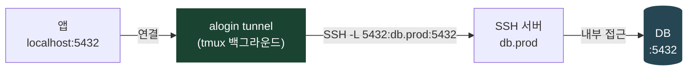
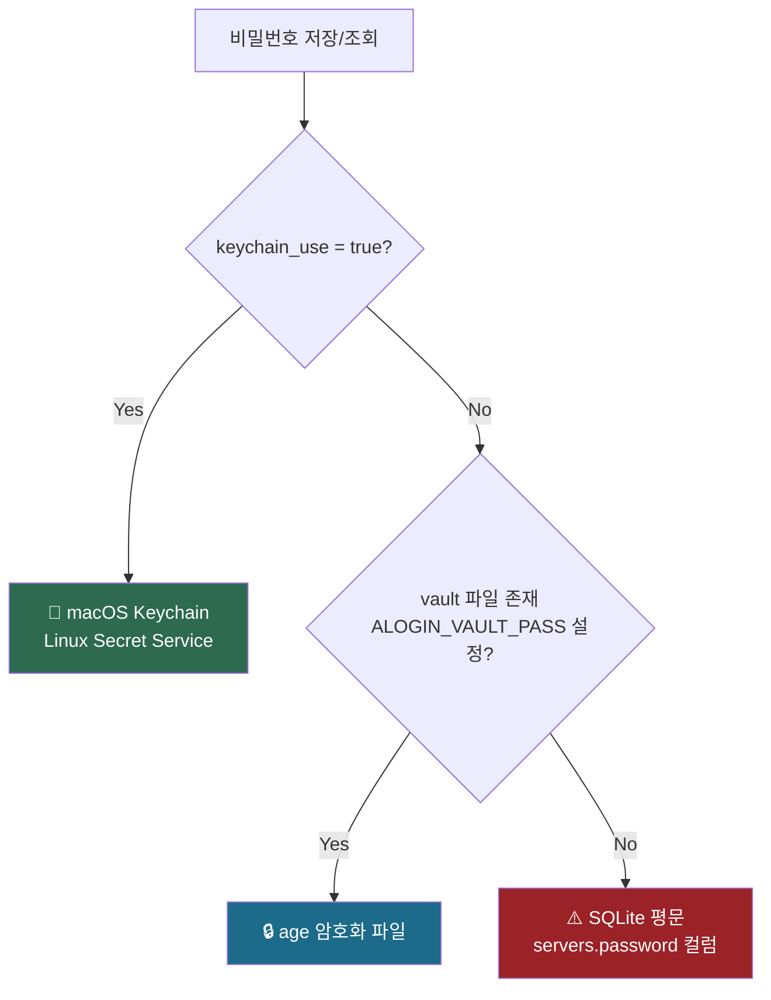
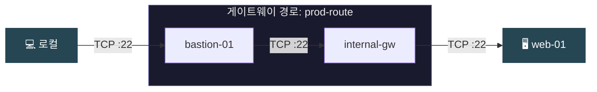
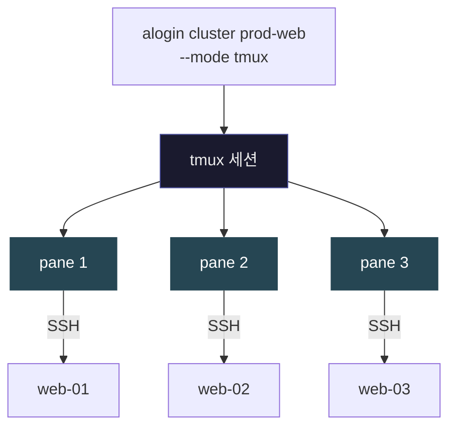
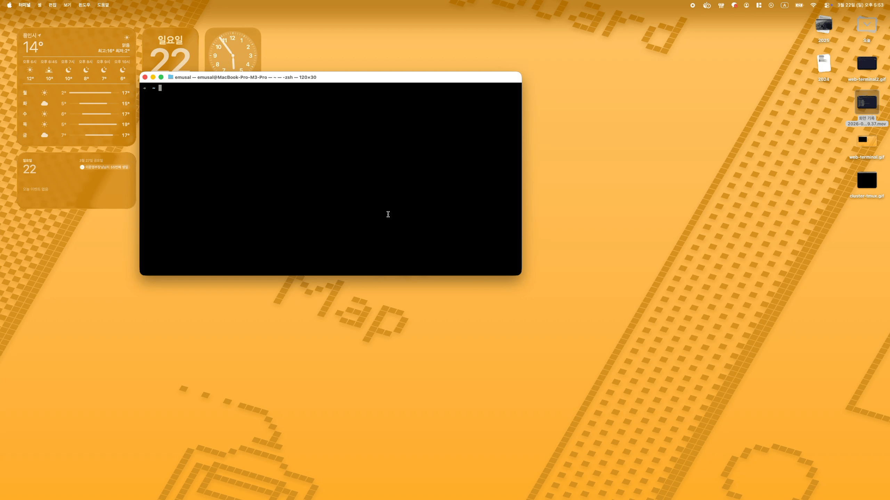

# alogin 2

**macOS · Linux용 SSH 접속 관리 도구** — 대화형 TUI 호스트 선택기, 암호화 자격증명 저장소, 멀티홉 게이트웨이 라우팅, 클러스터 세션, 브라우저 기반 웹 터미널.

> 2000년대 초 Bash + Expect 스크립트로 만들어진 [alogin v1](https://github.com/emusal/alogin)을 Go로 완전히 재작성한 버전입니다.

**언어** : 한국어 | [English](README.en.md)

---

<!-- 📸 스크린샷 #1: TUI 호스트 선택기
     장면: `alogin connect` 또는 `alogin tui` 실행 직후 전체 TUI 화면.
     퍼지 검색창에 일부 호스트명이 입력된 상태, 매칭된 여러 호스트가 하이라이트된 목록.
     터미널 배경은 어두운 색으로, 화살표 커서가 한 항목에 위치한 모습.
-->


---

## 기능

- **대화형 TUI** — 화살표 키 + 퍼지 검색으로 호스트 선택 (호스트명 전체 입력 불필요)
- **순수 Go SSH 클라이언트** — `expect` 없음, 프롬프트 패턴 파싱 없음
- **멀티홉 게이트웨이** — 배스천 호스트를 통한 투명한 ProxyJump 체이닝
- **암호화 자격증명 저장소** — macOS Keychain, Linux Secret Service, 또는 `age` 암호화 파일
- **클러스터 세션** — tmux(크로스플랫폼) 또는 iTerm2 / Terminal.app(macOS)으로 다중 호스트 동시 접속
- **Web UI** — 브라우저 기반 SSH 터미널 + 서버 관리 대시보드 (`alogin web`)
- **영구 SSH 터널** — tmux 백그라운드 세션으로 포트포워딩을 유지하는 명명된 터널 (`alogin tunnel`)
- **셸 단축 명령어** — `t`, `r`, `s`, `f`, `m`, `ct`, `cr` 단축 명령어 및 탭 자동완성 (`alogin shell-init`)
- **마이그레이션 도구** — `server_list`, `gateway_list`, `clusters` 등 v1 파일을 한 번에 가져오기

---

## 설치

### 스크립트 설치 (Linux / macOS)

```bash
curl -fsSL https://raw.githubusercontent.com/emusal/alogin2/main/install.sh | sh
```

`~/.local/bin/alogin`에 Web UI 포함 바이너리를 설치합니다. 환경변수로 커스터마이징 가능:

```bash
# CLI-only 버전 (Web UI 제외, 더 작은 파일)
curl -fsSL https://raw.githubusercontent.com/emusal/alogin2/main/install.sh | ALOGIN_NO_WEB=1 sh

# 특정 버전 설치
curl -fsSL https://raw.githubusercontent.com/emusal/alogin2/main/install.sh | ALOGIN_VERSION=2.0.3 sh

# 커스텀 설치 경로 (예: /usr/local/bin, sudo 필요 시 별도 처리)
curl -fsSL https://raw.githubusercontent.com/emusal/alogin2/main/install.sh | ALOGIN_INSTALL_DIR=/usr/local/bin sh
```

### Homebrew (macOS, 권장)

```bash
brew tap emusal/alogin --custom-remote git@github.com:emusal/alogin2.git
brew install alogin
```

### Windows

네이티브 Windows 바이너리는 미지원입니다. WSL(Windows Subsystem for Linux) 환경에서 위 스크립트로 설치하세요.

### 바이너리 직접 다운로드

[Releases](https://github.com/emusal/alogin2/releases) 페이지에서 직접 받을 수도 있습니다.

```bash
# macOS (Apple Silicon)
curl -fsSL https://github.com/emusal/alogin2/releases/latest/download/alogin-web-darwin-arm64 -o ~/.local/bin/alogin
chmod +x ~/.local/bin/alogin

# macOS (Intel)
curl -fsSL https://github.com/emusal/alogin2/releases/latest/download/alogin-web-darwin-amd64 -o ~/.local/bin/alogin
chmod +x ~/.local/bin/alogin

# Linux (amd64)
curl -fsSL https://github.com/emusal/alogin2/releases/latest/download/alogin-web-linux-amd64 -o ~/.local/bin/alogin
chmod +x ~/.local/bin/alogin

# Linux (arm64)
curl -fsSL https://github.com/emusal/alogin2/releases/latest/download/alogin-web-linux-arm64 -o ~/.local/bin/alogin
chmod +x ~/.local/bin/alogin
```

### 소스 빌드

Go 1.23 이상 필요.

```bash
git clone https://github.com/emusal/alogin2.git
cd alogin2
go build -o alogin ./cmd/alogin
sudo mv alogin /usr/local/bin/
```

### 업그레이드

```bash
# 최신 버전으로 업그레이드
alogin upgrade

# 확인 프롬프트 건너뜀
alogin upgrade --yes
```

Homebrew로 설치한 경우에는 `brew upgrade alogin`을 사용하세요.

### 제거

```bash
# 바이너리, 완성 스크립트, 설정 제거 (데이터베이스·볼트는 보존)
alogin uninstall

# 모든 데이터 포함 완전 제거 (데이터베이스·볼트까지 삭제, 복구 불가)
alogin uninstall --purge

# 스크립트로 제거 (바이너리가 없거나 원격 실행 시)
curl -fsSL https://raw.githubusercontent.com/emusal/alogin2/main/uninstall.sh | sh

# 완전 제거 (스크립트)
curl -fsSL https://raw.githubusercontent.com/emusal/alogin2/main/uninstall.sh | ALOGIN_PURGE=1 sh
```

---

## 빠른 시작

### 셸 초기화 설정

`~/.zshrc` 또는 `~/.bashrc`에 추가:

```bash
source <(alogin shell-init)
```

단축 명령어와 탭 자동완성이 활성화됩니다:

```bash
t web-01          # SSH 접속 (직접)
r admin@bastion   # SSH 접속 (게이트웨이 자동 감지)
s web-01          # SFTP
f ftp-server      # FTP
m web-01          # SSHFS 마운트
ct prod-cluster   # 클러스터 접속 (타일 창)
cr prod-cluster   # 게이트웨이 경유 클러스터 접속
```

### 1. 설치 확인

```bash
alogin version
```

데이터베이스는 첫 실행 시 `~/.local/share/alogin/alogin.db`에 자동 생성됩니다.

### 2. v1에서 마이그레이션

기존 v1 설치가 있다면:

```bash
alogin migrate --from /path/to/old/alogin
```

`server_list`, `gateway_list`, `alias_hosts`, `clusters`, `term_themes`를 SQLite로 가져오고, 비밀번호는 시스템 키체인으로 이동합니다.

### 3. 서버 추가

```bash
alogin server add
```

프로토콜, 호스트, 사용자, 포트, 게이트웨이, 로케일을 입력합니다.
비밀번호는 시스템 키체인(macOS Keychain / Linux Secret Service)에 저장되며 데이터베이스에는 저장되지 않습니다.

### 4. 접속

```bash
alogin connect              # 대화형 TUI 선택기 실행
alogin connect web-01       # 호스트명으로 직접 접속
alogin connect admin@web-01 # 사용자 지정
```

---

## 명령어

### TUI

```bash
alogin tui
```

대화형 터미널 UI를 실행합니다. 화살표 키로 탐색하고, 퍼지 검색으로 호스트를 필터링하며, `Enter`로 접속합니다. `alogin connect`(인수 없이)와 동일하지만 웰컴 화면에서 시작합니다.

### 접속

```
alogin connect [user@]host... [flags]

  --auto-gw              게이트웨이 자동 감지 (v1 'r' 동작)
  --dry-run              실제 접속 없이 경로만 출력
  -c, --cmd string       로그인 후 실행할 명령어
  -L, --local-forward    로컬 포트 포워딩: PORT | LPORT:RPORT | LPORT:host:RPORT | lhost:LPORT:host:RPORT
  -R, --remote-forward   역방향 포트 포워딩 (SSH -R): RPORT:lhost:LPORT | rhost:RPORT:lhost:LPORT
```

```bash
t web-01                                # 단축어
r web-01                                # 단축어 (게이트웨이 자동 감지)

alogin connect                          # TUI 선택기
alogin connect web-01                   # 직접 접속
alogin connect gw-01 web-01             # 명시적 2홉
alogin connect gw-01 gw-02 web-01       # 명시적 3홉
alogin connect web-01 --auto-gw         # 등록된 게이트웨이 경유
alogin connect web-01 -L 2222:22        # 로컬 2222 → web-01:22 포트포워딩
alogin connect web-01 --auto-gw -L 2222:22  # 게이트웨이 경유 + 포트포워딩
```

#### 원격 명령어 실행 (`--cmd`)

접속 후 지정한 명령어를 실행하고 종료합니다.

```bash
alogin connect web-01 --cmd "uptime"
alogin connect web-01 --cmd "df -h && free -m"
```

여러 명령어를 순서대로 실행하려면 배치 파일을 만들어 표준 입력으로 넘깁니다:

```bash
# cmd.bat 예시
cat > cmd.bat << 'EOF'
cd /var/log
tail -20 syslog
df -h
EOF

alogin connect web-01 < cmd.bat
```

`--cmd`는 PTY 없이 실행되므로 출력을 파이프하거나 다른 명령어와 연결하기 좋습니다. 반면 `< cmd.bat`은 인터랙티브 셸에 명령어를 순서대로 입력하는 방식이라 프롬프트 대기 없이 연속 실행됩니다.

### 파일 전송

```bash
s web-01                                # sftp 단축어
f ftp-server                            # ftp 단축어
m web-01                                # mount 단축어

alogin sftp [user@]host [-p 로컬파일] [-g 원격파일]
alogin ftp  [user@]host
alogin mount [user@]host [원격경로]     # SSHFS 마운트
```

### 클러스터

```bash
ct prod-cluster                         # 단축어
cr prod-cluster                         # 단축어 (게이트웨이 경유)

alogin cluster [name] [flags]

  --gateway          게이트웨이 경유 (v1 'cr')
  --mode string      세션 모드: tmux (기본값), iterm, terminal
  -x, --tile-x int   타일 열 수 (0=자동)
```

### 서버 관리

```bash
alogin server list
alogin server add [--proto ssh] [--host host] [--user user] [--gateway name] [--locale loc]
alogin server show [user@]host
alogin server delete [user@]host
alogin server passwd [user@]host
alogin server getpwd [user@]host    # 저장된 비밀번호 확인
```

### 게이트웨이 관리

```bash
alogin gateway list
alogin gateway add
alogin gateway show name
alogin gateway delete name
```

### 별칭 관리

```bash
alogin alias list
alogin alias add
alogin alias show name
alogin alias delete name
```

### 마이그레이션

```bash
alogin migrate --from /path/to/alogin_root [--dry-run]
```

### 터널 관리

```bash
alogin tunnel [name] [flags]
```

tmux 백그라운드 세션으로 SSH 포트포워딩을 영구적으로 유지합니다.

```bash
# 터널 등록
alogin tunnel add db-local --server db.prod --local-port 5432 --remote-host db.prod --remote-port 5432
alogin tunnel add web-local --server web-01 --dir L --local-port 8080 --remote-host localhost --remote-port 80

# 시작 / 정지 / 상태
alogin tunnel start db-local    # tmux 세션에서 포워딩 시작
alogin tunnel stop  db-local
alogin tunnel status db-local

# 목록 / 수정 / 삭제
alogin tunnel list
alogin tunnel edit db-local --remote-port 5433
alogin tunnel rm   db-local

# TUI로 관리
alogin tunnel                   # TUI 터널 관리 화면으로 진입 (/tunnel 슬래시 커맨드)
```

**`--dir L` (기본값): 로컬 포워딩** — 로컬 포트를 원격 서버의 포트로 연결



**`--dir R`: 역방향 포워딩** — 원격 서버의 포트를 로컬로 연결


`--auto-gw`: 서버에 등록된 게이트웨이 경유

### Web UI

```bash
alogin web [--port 8484] [--no-browser]
```

`http://localhost:8484`을 자동으로 엽니다.

### 업그레이드

```bash
alogin upgrade          # 최신 릴리즈로 업그레이드 (GitHub 확인)
alogin upgrade --yes    # 확인 프롬프트 건너뜀
```

GitHub Releases에서 최신 버전을 확인하고, 현재 플랫폼에 맞는 바이너리를 다운로드해 in-place 교체합니다. Homebrew로 설치한 경우 `brew upgrade alogin`을 사용하세요.

### 셸 자동완성

```bash
alogin completion install              # zsh (기본값)
alogin completion install --shell bash # bash
```

---

## 설정

기본 경로 (XDG 규격):

| 경로 | 설명 |
|------|------|
| `~/.local/share/alogin/alogin.db` | SQLite 데이터베이스 |
| `~/.local/share/alogin/vault.age` | age 암호화 저장소 (폴백) |
| `~/.config/alogin/config.toml` | 설정 파일 |
| `~/.local/share/alogin/alogin.log` | 로그 파일 |

환경 변수로 오버라이드:

```bash
ALOGIN_DB            # SQLite 데이터베이스 경로
ALOGIN_CONFIG        # config.toml 경로
ALOGIN_LOG_LEVEL     # 0=오류, 1=정보, 2=디버그 (기본값: 0)
ALOGIN_LANG          # 기본 로케일 (기본값: 시스템)
ALOGIN_SSHOPT        # 추가 SSH 옵션
ALOGIN_SSHCMD        # 커스텀 SSH 바이너리 경로
ALOGIN_KEYCHAIN_USE  # 설정 시 Keychain 강제 사용
ALOGIN_ROOT          # 레거시: DB + 설정 상위 디렉토리
```

`config.toml` 예시:

```toml
[ssh]
default_options = "-o StrictHostKeyChecking=no -o ServerAliveInterval=30"
connect_timeout = 10

[vault]
backend = "keychain"   # keychain | libsecret | age | plaintext

[web]
port = 8484
```

---

## 보안

### 자격증명 저장

비밀번호는 설정에 따라 다음 백엔드 중 하나에 저장됩니다 (우선순위 순):



보안이 필요한 환경에서는 반드시 Keychain 또는 age 백엔드를 설정하세요:

```toml
# ~/.config/alogin/config.toml
[vault]
keychain_use = true
```

### SSH 키 인증

alogin은 `~/.ssh/config` 및 SSH 에이전트를 자동으로 사용합니다. SSH 키를 배포한 호스트는 비밀번호 입력 없이 접속됩니다.

---

## 멀티홉 게이트웨이

게이트웨이 경로 정의:

```bash
alogin gateway add
# name: prod-route
# hops: bastion-01 → internal-gw → (목적지)
```

서버에 할당:

```bash
alogin server add
# ...
# gateway: prod-route
```

alogin은 Go 네이티브 SSH 라이브러리로 각 홉을 순서대로 다이얼합니다:



중간 홉에서 `AllowTcpForwarding`이 비활성화된 경우, alogin은 자동으로 **셸 체인 방식**으로 폴백합니다:


셸 체인은 ProxyJump TCP 포워딩을 사용하지 않으므로 `AllowTcpForwarding` 제한에 영향을 받지 않습니다 (v1의 `conn.exp` 동작과 동일).

---

## 클러스터 세션

클러스터의 모든 멤버에 동시 접속:

```bash
alogin cluster prod-web --mode tmux      # tmux 분할 창 (macOS + Linux)
alogin cluster prod-web --mode iterm     # iTerm2 분할 창 (macOS)
alogin cluster prod-web --mode terminal  # Terminal.app 타일 (macOS)
```



클러스터 관리:

```bash
alogin cluster add prod-web web-01 web-02 web-03
alogin cluster list
alogin cluster show prod-web
alogin cluster delete prod-web
```

<!-- 📸 스크린샷 #2: 클러스터 tmux 세션
     장면: `alogin cluster prod-web --mode tmux` 실행 후의 터미널 전체 화면.
     tmux가 화면을 3~4개의 창으로 분할하고, 각 창에 서로 다른 서버(web-01, web-02, web-03 등)로의
     SSH 세션이 열려 있는 모습. 각 창의 상단에 서버명이 표시되면 이상적.
-->


---

## Web UI

```bash
alogin web [--port 8484] [--no-browser]
```

실행하면 `http://localhost:8484`를 자동으로 브라우저에서 엽니다.

| 옵션 | 기본값 | 설명 |
|------|--------|------|
| `--port` | `8484` | HTTP 리스닝 포트 |
| `--no-browser` | — | 브라우저 자동 열기 억제 |

제공 기능:

- **서버 목록** — 검색, 탐색, 접속
- **웹 터미널** — 브라우저의 xterm.js 기반 완전한 SSH 세션
- **클러스터 관리** — 클러스터 생성 및 편집
- **터널 관리** — 터널 추가/편집/삭제, 시작/정지/상태 확인

<!-- 📸 스크린샷 #4: Web 브라우저 SSH 터미널
     장면: Web UI에서 특정 서버를 클릭해 SSH 세션이 열린 화면.
     브라우저 안에 xterm.js 기반 터미널이 표시되고, 서버 프롬프트가 보이는 상태.
     `ls -la` 또는 `top` 같은 명령어가 실행 중인 모습이면 더 좋음.
-->



웹 서버는 기본적으로 로컬 전용입니다. 인증 없이 네트워크에 노출하지 마세요.

---

## v1 마이그레이션

alogin v2는 v1 데이터 파일과 완전히 호환됩니다. 한 번만 실행하면 됩니다:

```bash
alogin migrate --from $ALOGIN_ROOT
```

마이그레이션 내용:
- `server_list`, `gateway_list`, `alias_hosts`, `clusters`, `term_themes` 파싱
- `<space>` / `<tab>` 리터럴을 실제 문자로 변환
- 모든 데이터를 SQLite로 가져오기
- 비밀번호를 시스템 키체인으로 이동 (데이터베이스에서 제거)
- 원본 파일은 그대로 보존

아직 설정하지 않았다면 셸 초기화도 추가하세요:

```bash
source <(alogin shell-init)
```

---

## 개발

### 사전 요구사항

- Go 1.23+
- Node.js 20+ (Web UI 프론트엔드 빌드 시에만 필요)

### 빌드

```bash
# CLI만
go build ./cmd/alogin

# Web UI 프론트엔드 (임베드 전 필요)
cd web/frontend && npm install && npm run build

# Web UI 포함 전체 빌드
go build -tags web ./cmd/alogin
```

### 테스트

```bash
go test ./...
go vet ./...
```

### 크로스 컴파일

```bash
make dist       # darwin/arm64, darwin/amd64, linux/amd64, linux/arm64
make dist-web   # Web UI 포함 macOS 빌드
```

### 프로젝트 구조

```
cmd/alogin/          진입점
internal/
  cli/               Cobra 커맨드 정의
  config/            설정 로딩 (XDG + 환경 변수)
  model/             데이터 타입 (Server, Gateway, Cluster ...)
  db/                SQLite 저장소 (스키마: internal/db/schema.sql)
  vault/             시크릿 백엔드 (Keychain / libsecret / age / plaintext)
  ssh/               네이티브 SSH 클라이언트 (멀티홉, PTY, 터널, SFTP, SSHFS)
  migrate/           v1 TSV → SQLite 마이그레이션 파서
  cluster/           클러스터 세션 오케스트레이션 (tmux / iTerm2 / Terminal.app)
  tui/               Bubbletea 대화형 호스트 선택기
  tunnel/            tmux 기반 영구 SSH 터널 관리 (start/stop/status)
  web/               HTTP 서버 + WebSocket 터미널 + REST API
web/frontend/        React + xterm.js (Vite)
completions/         셸 심 + zsh/bash 자동완성 스크립트
docs/                상세 문서
```

---

## 라이선스

MIT
