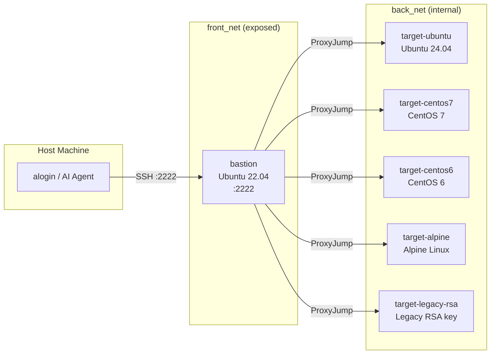

<div align="center">
  
  <a href="https://github.com/emusal/alogin2/releases"></a>
  <a href="https://github.com/emusal/alogin2/blob/main/LICENSE"></a>
</div>

---

**alogin 2** is a secure Security Gateway designed for Agentic AI, LLMs, and System Administrators to safely access infrastructure.


It is a full Go rewrite of the original [alogin v1](https://github.com/emusal/alogin) (~2000s era Bash + Expect scripts). It serves as a secure conduit for AI agents to access servers, while bringing a rich interactive TUI, an encrypted credential vault, multi-hop gateway routing, and cluster session capabilities for human operators.

**Language** : [한국어](README.ko.md) | English

## Highlights

alogin 2 is designed with a clear division of labor between Humans and AI Agents:

### 🧑‍💻 For Human Operators
- **Interactive TUI** — Fuzzy-search host picker with arrow navigation (no more typing full hostnames)
- **Cluster sessions** — Connect to multiple hosts simultaneously via tmux (cross-platform) or iTerm2 / Terminal.app (macOS)
- **Shell shortcuts** — Quick access with `t`, `r`, `s`, `f`, `m`, `ct`, `cr` shorthand commands
- **Web UI** — Browser-based SSH terminal + server management dashboard (`alogin web`)
- **Encrypted credential vault** — Securely store passwords in macOS Keychain, Linux Secret Service, or `age`-encrypted files

### 🤖 For AI Agents (MCP)
- **Agentic AI integration** — Built-in [Model Context Protocol (MCP)](https://modelcontextprotocol.io) server allows seamless connection for LLM clients.
- **Abstracted Connectivity** — Agents don't need to decrypt passwords or understand ProxyJumps; they simply request to run commands on abstract "server IDs".
- **Structured Outputs** — `--format=json` on all CLI commands for easy LLM parsing.
- **Full Audit Trail** — Every command executed by an AI Agent is strictly recorded to a `JSONL` audit log (`audit.jsonl`).

Table of Contents
-----------------

<!-- vim-markdown-toc GFM -->
* [Installation](#installation)
    * [Setting up shell integration](#setting-up-shell-integration)
* [Core Concept: Human & Agent Workflow](#core-concept-human--agent-workflow)
* [Use Case Scenarios](#use-case-scenarios)
    * [Scenario 1: The Human Operator (CLI & TUI)](#scenario-1-the-human-operator-cli--tui)
    * [Scenario 2: AI Infrastructure Management (MCP)](#scenario-2-ai-infrastructure-management-mcp)
* [Test Environment (`testenv`)](#test-environment-testenv)
* [Usage Reference](#usage-reference)
    * [Quick Start](#quick-start)
    * [Commands Overview](#commands-overview)
    * [Connection & Tunnels](#connection--tunnels)
* [AI Agent Integration (MCP)](#ai-agent-integration-mcp)
    * [MCP Tools Reference](#mcp-tools-reference)
* [Advanced topics](#advanced-topics)
    * [Multi-hop Gateway Routing](#multi-hop-gateway-routing)
    * [Cluster Sessions](#cluster-sessions)
    * [Security & Vault](#security--vault)
* [License](#license)
<!-- vim-markdown-toc -->

Installation
------------

### Script install (Linux / macOS)
You can use `curl` to automatically download and install alogin.

```bash
curl -fsSL https://raw.githubusercontent.com/emusal/alogin2/main/install.sh | sh
```
*Tip: Use `ALOGIN_NO_WEB=1` env var to install a smaller CLI-only binary without the web interface.*

### Using Homebrew (macOS)
```bash
brew tap emusal/alogin --custom-remote git@github.com:emusal/alogin2.git
brew install alogin
```

### Windows
Native Windows binaries are not supported. Install via WSL (Windows Subsystem for Linux) using the script above.

### Setting up shell integration
Add the following line to your shell configuration file (`~/.zshrc` or `~/.bashrc`) to enable shorthand aliases and tab completion.
```bash
source <(alogin shell-init)
```

Core Concept: Human & Agent Workflow
------------------------------------

alogin 2 relies on human administrators to configure the initial "trust layer" so that AI agents can operate safely. 

1. **Human Administrators** are responsible for provisioning trust. They register servers, define gateway routes (jump hosts), store passwords in the secure vault, and group matching servers together into Clusters.
2. **AI Agents** connect via the MCP server. Because the human has already established the secure pathways and credentials, the Agent can simply scan the registry (`list_servers`), analyze clusters (`get_cluster`), and execute parallel SSH tasks (`exec_on_cluster`) without needing to know *how* to authenticate.

Use Case Scenarios
------------------

### Scenario 1: The Human Operator (CLI & TUI)
For daily operations, humans want fast, frictionless access:

```bash
# Connect to the primary database instantly using a shell shortcut
t db-primary

# Open the visual fuzzy-search interface to find an old server
alogin tui

# Mount a remote file system locally using SSHFS shorthand
m nas-server /mnt/local_nas

# Tile three production web servers simultaneously using tmux
ct prod-web-cluster
```

### Scenario 2: AI Infrastructure Management (MCP)

To let an AI Agent manage your servers, the Human must prepare the registry first.

**1. Human Preparation Phase**
The administrator maps out the remote infrastructure so the AI has permission to touch it:
```bash
# 1. Add servers to the encrypted registry
alogin compute add --host 10.0.0.10 --user admin  # Prompts for vault password
alogin compute add --host 10.0.0.11 --user admin

# 2. Group them so the AI can run batch tasks easily
alogin access cluster add web-cluster 10.0.0.10 10.0.0.11
```

**2. Agent Execution Phase**
Run `alogin agent setup` to print the exact config snippet and system prompt to copy:

```
$ alogin agent setup

alogin — Security Gateway for Agentic AI
========================================

MCP server config (paste into Claude Desktop claude_desktop_config.json):

  {
    "mcpServers": {
      "alogin": {
        "command": "/usr/local/bin/alogin",
        "args": ["agent", "mcp"]
      }
    }
  }

Recommended system prompt snippet:
  You have access to alogin, a secure SSH gateway for agentic infrastructure access.
  ...

Available MCP tools (12): list_servers, get_server, list_tunnels, ...
Audit log: ~/.config/alogin/audit.jsonl
```

Paste the JSON block into `~/Library/Application Support/Claude/claude_desktop_config.json` (macOS) and restart Claude Desktop.

Now, the Human can type natural language instructions to Claude:
> **Human:** *"Check the disk space on the entire web-cluster."*
> **Claude:** Uses `get_cluster_info` to find the nodes, then uses `exec_on_cluster` to execute `df -h` on both nodes in parallel. It reads the stdout natively and summarizes the risk back to the Human. 

Test Environment (`testenv`)
----------------------------

alogin 2 includes a fully virtualized **Docker Compose** sandbox inside the `testenv/` directory to safely test agentic behaviors, script multi-hop SSH routing, and validate cross-OS compatibility.

**Network topology:**



**Included Nodes:**
* `bastion` (Ubuntu 22.04) — The only node exposed to the host machine on port `2222`. Acts as the jump host for all back-net targets.
* `target-ubuntu` (Ubuntu 24.04) — Standard modern testing node.
* `target-centos7` (CentOS 7) — Legacy EOL OS compatibility (sysvinit, older package managers).
* `target-centos6` (CentOS 6) — Very old EOL OS for extreme legacy testing.
* `target-alpine` (Alpine) — Lightweight container OS.
* `target-legacy-rsa` (Legacy RSA key) — Tests SSH connections requiring old RSA host keys.

**How to run it:**
```bash
cd testenv/
docker-compose up -d --build
```
You can now ask the Agent to login to `target-ubuntu` safely by defining `bastion` as the gateway route. 

Usage Reference
---------------

### Quick Start
**1. Verify installation**
```bash
alogin version
```
**2. Add a server & Connect**
```bash
alogin compute add
alogin access ssh web-01       # or use 't web-01'
```

### Commands Overview
All legacy v1 commands remain as backward-compatible aliases.

```
alogin compute          Server registry management (aliased: server)
alogin access           Remote connectivity (aliased: connect, t, r)
alogin auth             Credentials, gateway routes, host aliases
alogin agent            AI MCP server, client setup tools
alogin net              Hosts definitions, Background SSH tunnels
alogin app-server       Named server+plugin bindings (one-name launch)
```

**JSON Output for scripts:** All listing commands support `--format=json`.

### Connection & Tunnels
```bash
alogin access ssh gw-01 web-01                 # Explicit 2-hop route
alogin access ssh web-01 --auto-gw             # Route automatically via registered gateway
alogin access ssh web-01 --cmd "uptime"        # Run isolated command & exit
alogin access ssh web-01 --app mariadb         # Connect and launch app plugin (e.g. MariaDB client)
```

**Tunnels:** Easily persist SSH port-forwards inside detached `tmux` background sessions, so they survive terminal disconnects.
```bash
alogin net tunnel add web-local --server web-01 --local-port 8080 --remote-port 80
alogin net tunnel start web-local
```

### App-Server (Named Application Bindings)
Bind a server to an application plugin so one name launches the right app with automatic credential injection:
```bash
alogin app-server add --name prod-mysql --server prod-db --app mariadb --auto-gw
alogin app-server connect prod-mysql          # SSH → launch MariaDB client → auto-enter password
alogin app-server connect prod-mysql --cmd "SHOW DATABASES"  # non-interactive
alogin app-server list --format json
```
Plugin YAML files (`~/.config/alogin/plugins/<name>.yaml`) define the command, args, and PTY automation (expect/send) for credential injection.

AI Agent Integration (MCP)
--------------------------

alogin exposes a built-in [Model Context Protocol (MCP)](https://modelcontextprotocol.io) server so any LLM client can safely manage infrastructure without handling credentials or SSH routing directly.

> See [SKILL.md](SKILL.md) for a quick-start guide and [docs/SYSTEM_PROMPT.md](docs/SYSTEM_PROMPT.md) for a full system prompt reference.

### MCP Tools Reference

#### Query tools (read-only)

| Tool | Description |
|------|-------------|
| `list_servers` | List / search all servers in the registry |
| `get_server` | Get full details for a single server |
| `list_clusters` | List all cluster groups with member counts |
| `get_cluster` | Get a cluster with full member server details |
| `list_tunnels` | List tunnel configurations with live running status |
| `get_tunnel` | Get details and status for a single tunnel |
| `inspect_node` | Structured health snapshot — CPU, memory, disk, top processes |

#### Execution tools (write)

| Tool | Description |
|------|-------------|
| `exec_command` | Run SSH commands on a single server (non-interactive or PTY mode) |
| `exec_on_cluster` | Run SSH commands on all cluster servers in parallel |

#### Tunnel lifecycle tools

| Tool | Description |
|------|-------------|
| `start_tunnel` | Start a saved tunnel in a detached tmux session |
| `stop_tunnel` | Stop a running tunnel |

All `exec_command`, `exec_on_cluster`, and `inspect_node` calls are appended to `~/.config/alogin/audit.jsonl` and the `audit_log` SQLite table.

### Agentic Safety Rails

#### Global policy (`~/.config/alogin/agent-policy.yaml`)
```bash
alogin agent policy show       # Print the active global policy file
alogin agent policy validate   # Validate for syntax/pattern errors
```

#### Per-server policy & system prompt
Each server can override the global policy and carry a custom LLM system prompt stored in the database:
```bash
alogin agent server-policy set   <id> --file policy.yaml   # Set per-server policy
alogin agent server-policy show  <id>                       # Show per-server policy
alogin agent server-policy clear <id>                       # Revert to global policy

alogin agent server-prompt set   <id> --text "..."          # Set per-server system prompt
alogin agent server-prompt show  <id>                       # Show per-server system prompt
alogin agent server-prompt clear <id>                       # Remove per-server prompt
```

#### HITL (Human-in-the-Loop) approval
Destructive commands (or commands matching `require_approval` policy rules) pause for human approval:
```bash
alogin agent pending              # List pending approval requests
alogin agent approve <token>      # Approve a pending request
alogin agent deny    <token>      # Deny a pending request
```

#### Audit log
```bash
alogin agent audit list           # List recent MCP exec events
alogin agent audit list --since 1h --json
alogin agent audit tail           # Stream new events (Ctrl+C to stop)
```

Advanced topics
---------------

### Multi-hop Gateway Routing
Go's native SSH library handles ProxyJump natively. Simply define a route (`alogin auth gateway add`) and assign it. alogin bypasses `ProxyCommand` shells entirely on TCP streams. If an intermediate hop forbids `AllowTcpForwarding=no`, alogin smartly detects this and gracefully falls back to nested `ssh -tt` pseudo-terminal chaining.

### Cluster Sessions
When running `ct <cluster>`, alogin connects to all grouped members at once and synchronizes your inputs across panes.
```bash
alogin access cluster prod-web --mode tmux      # tmux panes (macOS + Linux)
alogin access cluster prod-web --mode iterm     # iTerm2 split panes (macOS)
```

### Security & Vault
Passwords are never blindly kept in the local SQLite DB unless explicitly forced. Priority order for secrets:
1. `macOS Keychain` / `Linux Secret Service` 
2. `age-encrypted file` (Fallback)
3. Direct `~/.ssh/config` Agent handling (Preferred! Put keys on your servers first!)

License
-------
Apache 2.0
