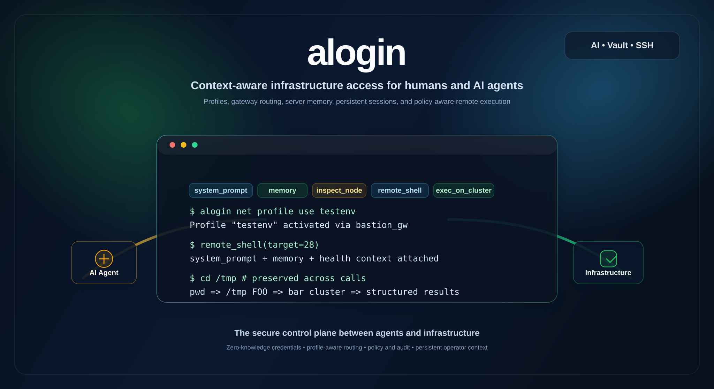
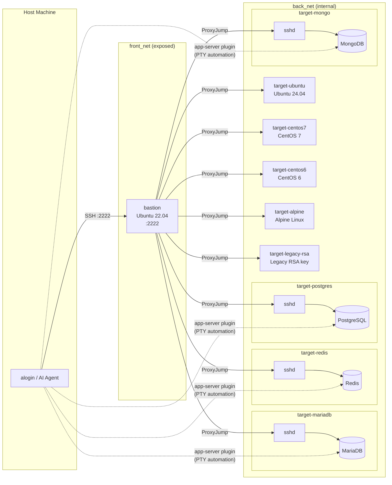

<div align="center">
  
  <a href="https://github.com/emusal/alogin2/releases"></a>
  <a href="https://github.com/emusal/alogin2/blob/main/LICENSE"></a>
</div>

---

**alogin 2** is context-aware infrastructure access for humans and AI agents.

It combines an encrypted server registry, named gateway routing, persistent SSH sessions, cluster execution, and an MCP bridge so agents can operate on real infrastructure without handling raw credentials, private IP topology, or ad-hoc shell glue.


Full Go rewrite of the original [alogin v1](https://github.com/emusal/alogin) (~2000s Bash + Expect). Built for daily operator workflow and agent-driven automation on the same encrypted registry.

**Language**: [한국어](README.ko.md) | English

---

## Why alogin2?

Managing real infrastructure creates two different problems at once:

- **Humans** waste time on repeated SSH commands, bastion chains, and per-host glue.
- **AI agents** need execution access, but should not see raw credentials, private IPs, or internal topology.

alogin2 resolves both with one control plane:

| Problem | Solution |
|---------|----------|
| Typing full hostnames for hundreds of nodes | [Fuzzy TUI search](#fuzzy-tui-search) → connect in 3 keystrokes |
| Access path changes depending on where you work | [Profiles + named gateway routes](#multi-hop-gateway-routing) |
| AI agents lacking server-specific operating context | [Server prompts, memory, and health inspection via MCP](#secure-ai-integration) |
| Multi-step remote work losing shell state | [Persistent SSH sessions with preserved cwd/env](#commands-overview) |
| Manual ProxyJump setup for bastion chains | [Named gateway routes with automatic multi-hop](#multi-hop-gateway-routing) |
| Running the same command across 20 nodes | [Cluster session with synchronized broadcast typing](#synchronized-broadcast-typing) |
| Aggregating command output from a fleet | [Parallel `exec_on_cluster` via MCP](#parallel-command-execution), results returned as structured data |
| AI agents needing SSH credentials / IPs | [MCP abstraction layer: agents use server IDs, alogin2 handles auth](#zero-knowledge-security-model) |
| Audit trail for AI-initiated commands | [Every exec logged to JSONL + SQLite `audit_log`](#audit-trail) |
| Runaway AI executing destructive commands | [Policy engine + HITL approval flow](#policy-engine--hitl-approval) |

### What Makes It Different

Most SSH tools stop at transport. `alogin2` adds the missing execution context that agents and operators need in practice:

- **Server registry**: stable IDs, aliases, auth metadata, device types
- **Profiles and gateways**: switch access paths based on your current network environment
- **Persistent sessions**: preserve cwd and environment across steps
- **Agent context**: expose server-specific prompts, memory notes, and health data before acting
- **Policy and audit**: gate risky commands and keep a review trail

### Five-Minute Quickstart

Install, register a host, connect, then expose the same registry to your AI client:

```bash
# 1. Install
curl -fsSL https://raw.githubusercontent.com/emusal/alogin2/main/install.sh | sh

# 2. Register a server
alogin server add --host 10.0.0.10 --user admin

# 3. Connect directly
alogin ssh connect 10.0.0.10

# 4. Start a persistent session
sid=$(alogin ssh session start 10.0.0.10)
alogin ssh session exec "$sid" "cd /var/log"
alogin ssh session exec "$sid" "pwd"

# 5. Enable MCP for your AI client
alogin agent setup
```

If you work from different network environments, add a named gateway and activate a profile for the access path you need:

```bash
alogin net gateway add corp-bastion bastion-01
alogin net profile add home --gateway corp-bastion --desc "Home network"
alogin net profile use home
```

---

## Table of Contents

- [Installation](#installation)
- [Why alogin2?](#why-alogin2)
- [Individual Efficiency: Eliminating Friction](#individual-efficiency-eliminating-friction)
  - [Fuzzy TUI Search](#fuzzy-tui-search)
  - [Multi-hop Gateway Routing](#multi-hop-gateway-routing)
  - [App-Server Plugin Bindings](#app-server-plugin-bindings)
- [Fleet Management: Control at Scale](#fleet-management-control-at-scale)
  - [Cluster Sessions (Tiled UI)](#cluster-sessions-tiled-ui)
  - [Synchronized Broadcast Typing](#synchronized-broadcast-typing)
  - [Parallel Command Execution](#parallel-command-execution)
  - [Persistent Background Tunnels](#persistent-background-tunnels)
- [Secure AI Integration](#secure-ai-integration)
  - [MCP Server Setup](#mcp-server-setup)
  - [Zero-Knowledge Security Model](#zero-knowledge-security-model)
  - [MCP Tools Reference](#mcp-tools-reference)
  - [Policy Engine & HITL Approval](#policy-engine--hitl-approval)
  - [Audit Trail](#audit-trail)
- [Security & Vault](#security--vault)
- [Commands Overview](#commands-overview)
- [Test Environment](#test-environment)
- [License](#license)

---

## Installation

### Script install (Linux / macOS)

```bash
curl -fsSL https://raw.githubusercontent.com/emusal/alogin2/main/install.sh | sh
```

> `ALOGIN_NO_WEB=1` installs a smaller CLI-only binary without the embedded web interface.

### Homebrew (macOS)

```bash
brew tap emusal/alogin --custom-remote git@github.com:emusal/alogin2.git
brew install alogin
```

### Windows (native)

Download the latest `.exe` from [GitHub Releases](https://github.com/emusal/alogin2/releases) and place it on your `PATH`:

```powershell
# PowerShell — download and install to %LOCALAPPDATA%\alogin
$dest = "$env:LOCALAPPDATA\alogin"
New-Item -ItemType Directory -Force $dest | Out-Null
Invoke-WebRequest -Uri "https://github.com/emusal/alogin2/releases/latest/download/alogin-windows-amd64.exe" `
  -OutFile "$dest\alogin.exe"
# Add to PATH for current session (add to $PROFILE for persistence)
$env:PATH += ";$dest"
```

> For the web UI with embedded frontend use `alogin-web-windows-amd64.exe` instead.

**Data directories on Windows:**

| Purpose | Path |
|---------|------|
| Database, vault, logs | `%LOCALAPPDATA%\alogin\` |
| Config file | `%APPDATA%\alogin\config.toml` |

**Shell completion (PowerShell):**

```powershell
alogin completion powershell | Out-String | Invoke-Expression
```

### Shell integration

After installing, add the following to `~/.bashrc` or `~/.zshrc`:

```bash
# 1. Make sure alogin is on your PATH (script installer uses ~/.local/bin)
export PATH="$HOME/.local/bin:$PATH"

# 2. Install tab-completion files (run once, not in shell profile)
alogin completion install --shell bash   # bash
# alogin completion install             # zsh (default)

# 3. Load completion + shorthand aliases on every new shell
source <(alogin completion bash)         # bash — enables tab-completion
source <(alogin shell-init)              # loads t, r, ct, cr, ... aliases
```

For **zsh**, use:

```zsh
export PATH="$HOME/.local/bin:$PATH"
alogin completion install                # run once
fpath=(~/.local/share/alogin/completions $fpath)  # add to ~/.zshrc
source <(alogin shell-init)
```

Then reload: `source ~/.bashrc` or open a new terminal.

---

## Individual Efficiency: Eliminating Friction

### Fuzzy TUI Search

Launch the interactive host picker. Type a partial hostname, tag, or IP. Arrow-navigate and press Enter to connect:

```bash
alogin tui
# or use shell alias:
t <partial-name>
```

No need to remember full hostnames across hundreds of nodes. Fuzzy match on any field.

### Multi-hop Gateway Routing

Define a named gateway route once, assign it to servers or activate it through a profile. Profiles are meant for switching the active access path based on the operator's current network environment, such as working from home, the office, or behind a VPN. alogin2 handles the full hop chain natively in Go — no `ProxyCommand` shell spawning, no `~/.ssh/config` edits:

```bash
# Register jump hosts as named routes (up to 3 hops)
alogin net gateway add corp-bastion bastion-01
alogin net gateway add dmz-chain bastion-01 dmz-relay

# Optional: activate a route based on where you're working
alogin net profile add home --gateway corp-bastion --desc "Home network"
alogin net profile use home

# Assign a gateway to a server
alogin server add --host 10.0.1.50 --user admin --gateway corp-bastion
alogin server add --host core-sw-01 --user admin --device-type router   # network device

# Connect — the active profile's gateway is applied automatically
t web-01
```

**ShellChain fallback:** If an intermediate hop has `AllowTcpForwarding no`, alogin2 automatically detects the failure and retries using nested `ssh -tt` pseudo-terminal chaining — no manual intervention required.

### App-Server Plugin Bindings

Bind a server to an application plugin (MariaDB, Redis, PostgreSQL, MongoDB, ...) so one command SSHes in, launches the client, and auto-injects credentials from the vault:

```bash
alogin app add --name prod-mysql --server prod-db --app mariadb
alogin app connect prod-mysql               # interactive session
alogin app connect prod-mysql --cmd "SHOW DATABASES;"  # non-interactive
alogin app list --format json
```

Plugin definitions live in `~/.config/alogin/plugins/<name>.yaml` and specify the launch command plus PTY expect/send sequences for credential injection.

---

## Fleet Management: Control at Scale

### Cluster Sessions (Tiled UI)

Group servers into a named cluster, then open all of them in a tiled tmux layout with a single command:

```bash
# Define a cluster
alogin ssh cluster add web-cluster web-01 web-02 web-03
alogin ssh cluster add db-shard db-primary db-replica1 db-replica2

# Open all nodes in tiled panes
ct web-cluster          # shell alias
alogin ssh cluster web-cluster --mode tmux    # tmux (Linux / macOS / Windows WSL)
alogin ssh cluster web-cluster --mode iterm   # iTerm2 split panes (macOS)
alogin ssh cluster web-cluster --mode wt      # Windows Terminal (Windows)
```

### Synchronized Broadcast Typing

After the tiled session opens, alogin2 waits for all panes to finish authenticating (vault credential injection per pane), then enables tmux `synchronize-panes`. Every keystroke you type goes to all nodes simultaneously:

```
# Once sync-panes is active, type once — runs on all nodes:
df -h
systemctl status nginx
tail -f /var/log/app/error.log
```

The sync delay is automatic: 5 seconds for ≤4 nodes, 8 seconds for ≤10 nodes, 12 seconds for larger clusters. This prevents broadcast from firing before password injection completes.

### Parallel Command Execution

Run a command against a cluster without an interactive session. Output is aggregated per node:

```bash
alogin ssh connect web-cluster --cmd "uptime"
alogin ssh connect db-shard    --cmd "df -h /data"
```

For AI agent use, `exec_on_cluster` runs commands in parallel and returns per-node results as structured JSON.

### Persistent Background Tunnels

Define port-forward tunnels backed by detached tmux sessions. They survive terminal disconnects and system sleep:

```bash
alogin net tunnel add grafana-fwd --server monitoring-01 --local-port 3000 --remote-port 3000
alogin net tunnel start grafana-fwd
alogin net tunnel list
alogin net tunnel stop  grafana-fwd
```

---

## Secure AI Integration

`alogin2` is built so an AI agent can gather context before it acts, not just fire blind remote commands.

Typical agent workflow:

1. Discover targets with `list_servers` or `get_server`
2. Read server-specific guidance with `get_server_prompt` and `get_memory`
3. Check live health with `inspect_node`
4. Open a stateful shell with `remote_shell` or run one-shot commands
5. Fan out with `exec_on_cluster`, run detached work, or manage tunnels as needed

This is the difference between "an LLM with SSH" and "an agent operating with server-aware context."

### MCP Server Setup

alogin2 exposes a [Model Context Protocol (MCP)](https://modelcontextprotocol.io) server over stdio. Run `alogin agent setup` to print the exact config snippet:

```
$ alogin agent setup

alogin — Security Gateway for Agentic AI
========================================

MCP server config (paste into Claude Desktop claude_desktop_config.json):

  {
    "mcpServers": {
      "alogin": {
        "command": "/usr/local/bin/alogin",
        "args": ["agent", "mcp"]
      }
    }
  }

Available MCP tools include: list_servers, get_server, get_server_prompt,
  get_memory, inspect_node, remote_shell, exec_command, exec_on_cluster,
  bg_exec_command, list_tunnels, start_tunnel, stop_tunnel, ...
Audit log: ~/.config/alogin/audit.jsonl
```

Paste the JSON block into the Claude Desktop config file for your platform and restart Claude Desktop:

| Platform | Config path |
|----------|-------------|
| macOS | `~/Library/Application Support/Claude/claude_desktop_config.json` |
| Linux | `~/.config/Claude/claude_desktop_config.json` |
| Windows | `%APPDATA%\Claude\claude_desktop_config.json` |

### Zero-Knowledge Security Model

This is the key security boundary:

```
AI Agent  ──→  alogin2 MCP  ──→  Vault  ──→  SSH Target
              (server IDs)    (decrypts)    (authenticates)
                  ↑
         Agent never sees:
         - passwords / private keys
         - raw IP addresses
         - gateway topology
         - vault contents
```

The AI works with abstract **server aliases and IDs**. alogin2 resolves the full authentication chain locally. The LLM context window never contains credentials or internal IP topology.

**Human setup, agent execution:**

```bash
# Human operator pre-provisions trust:
alogin server add --host 10.0.0.10 --user admin                          # stores creds in vault
alogin server add --host 10.0.0.11 --user admin
alogin server add --host fw-01 --user admin --device-type firewall        # network device
alogin ssh cluster add web-cluster 10.0.0.10 10.0.0.11

# AI agent then operates via MCP — server IDs only:
# list_servers → [ {id: 1, name: "web-01"}, {id: 2, name: "web-02"} ]
# exec_on_cluster(cluster_id=1, commands=["df -h"])
# → per-node stdout returned; no credentials passed to agent
```

### MCP Tools Reference

#### Query (read-only)

| Tool | Description |
|------|-------------|
| `list_servers` | List / search all servers in the registry |
| `get_server` | Full details for a single server |
| `get_server_prompt` | Read server-specific instructions, constraints, and operating guidance |
| `get_memory` | Retrieve saved operational notes and proven workarounds |
| `list_clusters` | List all cluster groups with member counts |
| `get_cluster` | Cluster with full member server details |
| `list_tunnels` | All tunnel configs with live running status |
| `get_tunnel` | Details and status for a single tunnel |
| `inspect_node` | Health snapshot: CPU, memory, disk, top processes |

#### Execution (write)

| Tool | Description |
|------|-------------|
| `exec_command` | Run SSH commands on a single server |
| `exec_on_cluster` | Run SSH commands on all cluster members in parallel |
| `remote_shell` | Start or reuse a persistent shell session with preserved cwd and environment |
| `bg_exec_command` | Launch a long-running job and poll logs or status later |

#### Tunnel lifecycle

| Tool | Description |
|------|-------------|
| `start_tunnel` | Start a saved tunnel in a detached tmux session |
| `stop_tunnel` | Stop a running tunnel |

All execution calls are appended to `~/.config/alogin/audit.jsonl` and the `audit_log` SQLite table.

### Policy Engine & HITL Approval

Define what an AI agent is allowed to do. Policies use first-match-wins rule evaluation with AND conditions:

**Global policy** (`~/.config/alogin/agent-policy.yaml`):

```yaml
rules:
  - match:
      commands: ["^(shutdown|reboot|halt|poweroff)", "^rm\\s", "^dd\\s", "^mkfs"]
    action: deny

  - match:
      commands: ["^systemctl\\s+(stop|disable|mask)"]
      server_ids: [1, 2, 3]
    action: require_approval

  - match:
      time_window: { start: "18:00", end: "08:00" }   # UTC
    action: deny

  - match: {}
    action: allow
```

**Per-server policy override:**

```bash
alogin agent server-policy set  <server-id> --file policy.yaml
alogin agent server-policy show <server-id>
alogin agent server-policy clear <server-id>   # revert to global
```

**Policy management:**

```bash
alogin agent policy show      # print active global policy
alogin agent policy validate  # syntax + pattern check
alogin agent policy dry-run --cmd "rm -rf /"          # check decision without executing
alogin agent policy dry-run --cmd "ls" --agent claude-dev --server 3 --json
```

**HITL (Human-in-the-Loop) approval:**

When a command matches `require_approval`, the MCP tool call blocks and a token is written to `~/.config/alogin/hitl/pending/`. The human reviews and approves or denies:

```bash
alogin agent pending              # list pending approval requests
alogin agent approve <token>      # approve
alogin agent deny    <token>      # deny
```

Built-in destructive pattern detection covers: `rm`, `dd`, `mkfs`, `shutdown`, `reboot`, `halt`, `poweroff`, `systemctl stop/disable/mask`, `DROP TABLE`, `TRUNCATE`, and file overwrite redirects (`>`).

### Audit Trail

```bash
alogin agent audit list                    # recent MCP exec events
alogin agent audit list --since 1h --json  # last hour, JSON output
alogin agent audit tail                    # stream new events (Ctrl+C to stop)
```

Each audit event captures: timestamp, agent ID, server/cluster, commands, intent, policy action, and HITL approval token.

---

## Security & Vault

Secrets are never stored in plaintext in SQLite. Priority chain:

1. **OS Keychain** — macOS Keychain, Linux Secret Service, or Windows Credential Locker (enabled via `keychain_use = true`)
2. **age-encrypted file** — `~/.local/share/alogin/vault.age` (or `%LOCALAPPDATA%\alogin\vault.age` on Windows), unlocked by a master passphrase
3. Plaintext fallback (explicit opt-in only)

SSH key-based auth is always preferred. Use vault storage only for password-based targets where key distribution is impractical.

### OS Keychain (macOS / Linux / Windows)

OS Keychain is **disabled by default**. Enable it via config file or environment variable:

```toml
# ~/.config/alogin/config.toml  (macOS / Linux)
# %APPDATA%\alogin\config.toml  (Windows)
keychain_use = true
```

```sh
# or via environment variable
export ALOGIN_KEYCHAIN_USE=true   # macOS / Linux
set ALOGIN_KEYCHAIN_USE=true      # Windows cmd
$env:ALOGIN_KEYCHAIN_USE="true"   # Windows PowerShell
```

| Platform | Backend | Requirement |
|----------|---------|-------------|
| macOS | Keychain (`security` CLI) | Built-in |
| Linux | Secret Service (`secret-tool`) | `libsecret-tools` + GNOME Keyring or KWallet |
| Windows | Credential Locker (PowerShell `PasswordVault`) | Windows 8+ (built-in) |

On **Linux**, install the required package:

```sh
# Debian/Ubuntu
sudo apt install libsecret-tools

# RHEL/Fedora
sudo dnf install libsecret
```

Headless servers (Vagrant, containers, CI) typically have no Secret Service — use the age vault instead.

### age-encrypted Vault (recommended for Linux servers)

The age vault encrypts all stored passwords with a master passphrase using [age](https://age-encryption.org). It works on any platform, including headless servers.

**Set the master passphrase** (required to activate the age vault):

```sh
export ALOGIN_VAULT_PASS=your-master-passphrase
```

Or add it to your shell profile (`~/.bashrc`, `~/.zshrc`):

```sh
echo 'export ALOGIN_VAULT_PASS=your-master-passphrase' >> ~/.bashrc
```

The vault file is created automatically at `~/.local/share/alogin/vault.age` when the first password is stored.

**Store and retrieve passwords:**

```sh
alogin vault set user@10.0.1.3        # prompts for password, stores encrypted
alogin vault get user@10.0.1.3        # retrieve
alogin vault delete user@10.0.1.3     # remove
```

Without `ALOGIN_VAULT_PASS`, the age vault is skipped and alogin falls back to the plaintext DB column.

---

## Commands Overview

```
alogin server           Server registry (add, list, show, alias, ...)
alogin app              Named server+plugin bindings
alogin ssh              SSH, SFTP, FTP, SSHFS, cluster sessions
alogin ssh session      Persistent stateful sessions (cwd/env preserved across commands)
alogin scp push/pull    File transfer to/from remote hosts via SFTP
alogin vault            Stored credentials (set, get, delete)
alogin net              Hosts, tunnels, gateways, profiles
alogin agent            MCP server, policy, HITL, audit
alogin tui              Interactive fuzzy TUI picker
alogin web              Embedded web server (browser SSH + dashboard)
alogin migrate v1       Import legacy ALOGIN v1 flat-file data
alogin migrate ssh-config  Import servers and gateways from ~/.ssh/config
```

All listing commands support `--format=json` for scripting.
Full reference: [docs/cli-command-map.md](docs/cli-command-map.md)

---

## Test Environment

alogin2 ships a Docker Compose sandbox under `testenv/` for validating multi-hop routing, cross-OS compatibility, MCP behavior, and app-server plugins.

```bash
cd testenv/
docker-compose up -d --build
bash testenv/setup_alogin_cluster.sh  # auto-register all targets
```

**Topology:**


```mermaid
graph LR
    subgraph host["Host Machine"]
        alogin["alogin / AI Agent"]
    end

    subgraph front_net["front_net (exposed)"]
        bastion["bastion\nUbuntu 22.04\n:2222"]
    end

    subgraph back_net["back_net (internal)"]
        ubuntu["target-ubuntu\nUbuntu 24.04"]
        centos7["target-centos7\nCentOS 7"]
        centos6["target-centos6\nCentOS 6"]
        alpine["target-alpine\nAlpine Linux"]
        legacy["target-legacy-rsa\nLegacy RSA key"]

        subgraph srv_mariadb["target-mariadb"]
            ssh_mariadb["sshd"] --> app_mariadb[("MariaDB")]
        end
        subgraph srv_redis["target-redis"]
            ssh_redis["sshd"] --> app_redis[("Redis")]
        end
        subgraph srv_postgres["target-postgres"]
            ssh_postgres["sshd"] --> app_postgres[("PostgreSQL")]
        end
        subgraph srv_mongo["target-mongo"]
            ssh_mongo["sshd"] --> app_mongo[("MongoDB")]
        end
    end

    alogin -- "SSH :2222" --> bastion
    bastion -- "ProxyJump" --> ubuntu
    bastion -- "ProxyJump" --> centos7
    bastion -- "ProxyJump" --> centos6
    bastion -- "ProxyJump" --> alpine
    bastion -- "ProxyJump" --> legacy
    bastion -- "ProxyJump" --> ssh_mariadb
    bastion -- "ProxyJump" --> ssh_redis
    bastion -- "ProxyJump" --> ssh_postgres
    bastion -- "ProxyJump" --> ssh_mongo

    alogin -. "app-server plugin\n(PTY automation)" .-> app_mariadb
    alogin -. "app-server plugin\n(PTY automation)" .-> app_redis
    alogin -. "app-server plugin\n(PTY automation)" .-> app_postgres
    alogin -. "app-server plugin\n(PTY automation)" .-> app_mongo
```

**SSH targets:** bastion (jump host, `:2222`), Ubuntu 24.04, CentOS 7, CentOS 6, Alpine, legacy RSA key server.

**App-server targets** (credentials: `testuser` / `testuser`): MariaDB, Redis, PostgreSQL, MongoDB.

For the full MCP tool reference and recommended LLM system prompt: [docs/SYSTEM_PROMPT.md](docs/SYSTEM_PROMPT.md)
For agent policy syntax and HITL workflow examples: [docs/agent-policy.md](docs/agent-policy.md)

---

## License

Apache 2.0
